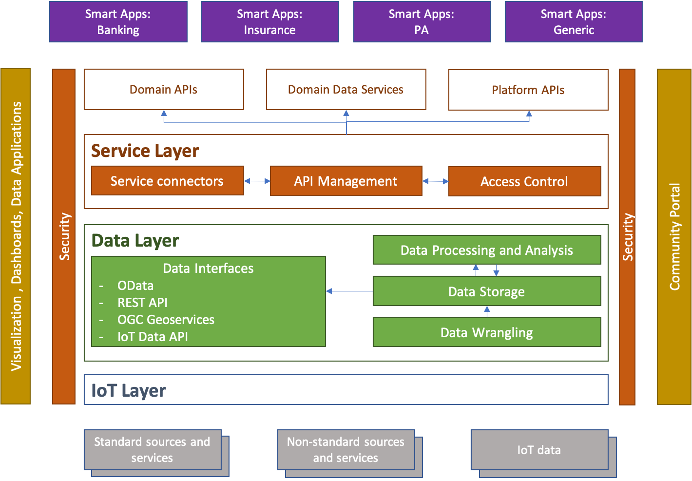

Digital Hub Architecture
========================

The goal of the Digital Hub platform is to address the following requirements:

* Possibility to integrate and manage data originating from **heterogeneous** data sources. 
  This possibility refers to both **alphanumeric** data and **geographical** data; data coming both 
  from standardized and **interoperable** sources (eg, Web services, open data formats) and from 
  **legacy** and non-standardized sources (eg, RDBMS, local files, proprietary systems), but also 
  data from sensors and devices in the  Internet of Things (IoT) domain.
* Offer tools and solutions to enrich data with **metadata** and semantic **relationships**, enabling 
  the creation of complex aggregations and data traceability. The platform aims at guaranteeing, in 
  particular, the alignment and compatibility of the data with respect to the domain model (e.g, mmaster data), 
  and reuse the reference models and interchange protocols. Some examples concerning the public 
  administration domain refer to

  * ANPR (National Registry of Resident Population)
  * Standardized ontologies and datasets of AGID DAF
  
* Possibility to elicit and catalogue appropriately enriched and annotated data.
* Provide tools and components necessary for **analysis**, **processing**, **aggregation**, and **visualization** 
  of the information present in the platform. Doing these activities, it is necessary 
  to maintain the right balance between the efficiency and performance of the solution on the one hand 
  and the need to replicate the data within the platform.
* **Expose** information and integrated functionalities using **standard** and **open** protocols. 
  This requirement concerns both data and services specific to the domains of interest of 
  the project and those exposed by the platform itself. Use of open standards is fundamental 
  for the creation of value-added services and applications, for the re-use of services in different contexts, 
  and to guarantee the decoupling of Digital Hub compared to the applications built above.
* Ensure appropriate level of security and access control in the management and display of data and services. 
  In particular,

  * Ensure that different actors (organizations, public bodies) who manage data through Digital Hub do not 
    interfere with one another as if they were managing isolated instances of the platform (**mutli-tenancy**).
  * Ensure that access to data and services is protected with open security protocols and the state of the art.
  * Manage access to data of end users by the operator and third parties in a clear and safe manner, respecting 
    national and international policies and regulations (eg GDPR).
    
Furthermore, non-functional requirements concerning the Digital Hub platform refer to

* Be an **open platform** to allow access to the artifacts exposed by the platform and to allow 
  everyone to interact with the platform.
* Permit extensibility of the platform with the new innovative tools and solutions, therefore **open innovation**.
* Enable re-use of the platform and its components through an **open source** paradigm.

Logical View
------------

The logical architecture of the DigitalHub platform is represented in the following diagram. In this architecture 
the fundamental elements are organized in two layers, in particular Service Layer (Service Hub) and Data Layer (Data Hub). 
These two parts of the platform are supported by the IoT layer (which facilitates the integration of data 
from "Internet of Things": sensors, devices, etc), from data **visualization and consumption tools** 
(dashboards, data apps), and **community portal** that delivers the data and services to the community (developers, consumers).

The data and services that the platform "consumes" can therefore characterize the different and heterogeneous sources. 
This includes IoT data, standardized services and data, non-interoperable systems (eg, databases, files, FTP, ...).

Data and services processed, surveyed, and enriched by the plan are exposed to applications using open and standard 
data protocols and models. In this way, the platform enables integration not only with local Smart Apps, but also 
with external reference systems, such as `DAF <https://docs.italia.it/italia/piano-triennale-ict/pianotriennale-ict-doc-en/en/stabile/doc/09_data-analytics-framework.html>`_.

DATA HUB
^^^^^^^^^
Data Layer consists of a set of tools that are necessary for the extraction, processing, aggregation, census, 
and representation of data in an open and standardized manner. In particular, these tools are structured as:

* **Data Wrangling**. By this name we mean the tools for extracting, preparing, processing, and harmonizing 
  data taken from non-interoperable and / or non-standard sources. Here processing can be activated in "pull" 
  mode (periodically accessing external sources such as relational DBs, FTP, files, etc) or 
  "push" (subscribing to data streams as queues or data streams).
* **Data Storage**. Data storage tools could be used to preserve data from non-interoperable sources that cannot 
  be queried "online" (for performance reasons, technological limits, etc.) and therefore must be replicated 
  within the Data Hub. This storage can be interpreted as a repository of mass data, Data Lake, with formats 
  that are not directly usable (Big Data, multimedia, etc.), or as "online" storage where data can be easily 
  interrogated quickly and effectively.
* **Data Processing and Analysis**. Tools of this Group are used to provide the advanced processing capabilities of 
  raw data taken from interoperable and non-interoperable sources. This analysis can also be applied to "big data", 
  with the complex logic created for a specific domain, specific application, and specific scenario. 
  The result of this processing can be used directly or transferred to the data storage for future processing and queries.
* **Data Interfaces**. These tools aim to display data using standard data protocols and models. As for the protocols, 
  they following ones are considered

  * `OData <https://www.oasis-open.org/news/pr/iso-iec-jtc-1-approves-oasis-odata-standard-for-open-data-exchange>`_: 
    an Internet-based open protocol for sharing, searching, and querying based on XML and JSON data formats. 
    OData facilitates access and interrogation of alpha-numeric table data coming, for example, from relational DBs.
  * REST API: data display through REST services for advanced operations and optimized for particular and effective uses.
  * `OGC Geoservices <http://www.opengeospatial.org/standards>`_: represent geographic information through standard 
    Web services for data, maps, and  data processing.
  * `SensorThings API <http://www.opengeospatial.org/standards/sensorthings>`_: display of data collected through the 
    IoT layer from different sensors and devices in standard mode for interrogation.

As for the data models, the objective is to use a set of reference models that have been defined by different bodies 
in specific domains, such as public administration, banking, insurance, mobility, etc. The data aligned with these 
models constitute the master data of the platform: the certified, validated, and compatible data with external systems. 
Examples of data models of this type refer to

* Ontologies and data models proposed by the Agency for Digital Italy (AGID)
* Data models of mobility and public transport (eg, GTFS)
* Data model behind interoperability services and bank payments (PSD2).
* Citizens' personal data (ANPR)
* Models for interoperable geographic datasets (INSPIRE)

The result of application of the Data Hub tools is exposed by the platform through standard interfaces to 
Service Hub and also to external tools for visualization or for use by the community side. 
The latter, in particular, occurs through the data catalog which is used to expose the Open, Semi-open, and also Closed Data  
to third parties in a protected manner.

SERVICE HUB
^^^^^^^^^^^^

Service Hub offers the tools to publish, manage, and govern the services (API) exposed by the domain 
and / or by the components of the platform in a protected and safe way. For this the tools are organized in

* **API Management**. In this category there are tools for documenting APIs, configuring access to them, defining 
  exposure modes and protocols, publishing them, and monitoring them. The published services are displayed in 
  standard and open mode, to facilitate access and use. The API management functionality follows the 
  interoperability model defined by the three-year plan for ICT in the PA and concerns the definition of 
  the service level, version traceability and service life cycle, documentation, access control management, 
  audit, analytics, etc.
* **Access Control**. The access control system allows to manage various types of users (developers and end users), 
  their access through various channels (eg, social networks), association of permissions and authorizations to the 
  platform, management of organizations that use platforms, protocols of access to services, etc. The access control system
  is based on the reference security protocols for API access, such as `OAuth2.0 <https://oauth.net/2/>`_.
* **Service Connectors**. Exposure of some services and functionalities very often must face the problem 
  of managing services that are not compatible with Open Services standards. This concerns, in particular, 
  access to legacy systems, services protected with "weak" or non-standard protocols, redundant or non-interoperable data. 
  Service connectors offer the possibility to mediate access to these services without significant effort. 
  These connectors can be added with enterprise integration tools (eg, flow brokers) or as independent applications.
  The open services displayed and managed by Service Hub are registered through an open catalog of services and can 
  be directly used by the various applications.

Key Concepts and Characteristics
-------------
To describe the various components of the platform, it is important to define some common features that each component 
must have to be an integral part of the same platform and its deployment and use model. These features refer 
to the interoperability model, organizational and multi-tenancy model, security, access control, and code 
distribution model.

Interopeability and Protocols
^^^^^^^^^^^^^^
Use of standard protocols at all possible levels of the platform is a fundamental requirement to guarantee 
extensibility and to avoid "vendor lock-in" of a solution that must be generic, customizable, and easy to integrate.

As for IoT data, the platform is based on various communication standards. In particular,

- REST and `MQTT <http://mqtt.org/>`_ APIs for generic solutions in the field of heterogeneous sensors and devices, 
  where communication takes place via the Internet connection.
- `LoraWAN <https://lora-alliance.org/>`_ protocol for urban scale networks.
- `NB-IoT <https://www.gsma.com/iot/narrow-band-internet-of-things-nb-iot/>`_ protocol for networks based on 
  infrastructure of mobile operators.

Regarding data exposure, the platform includes:

- Use of the `OData <https://www.odata.org/>`_ protocol for the display of generic data (tabular, relational) that 
  standardizes a query language and is based on REST http as transport protocol.
- REST protocol for exposure of data in specific cases, where the use of protocols as OData is not sufficient or is 
  not effective.
- `OGC <http://www.opengeospatial.org/standards/>`_ services (WMS, WFS, etc) for displaying geographical data, display 
  layers, etc.
- `SensorThings API <https://www.opengeospatial.org/standards/sensorthings>`_: protocol for display of IoT data that 
  standardizes the sensor model, surveys, data history, etc.

As for the display of services, the platform is based on

- `Open API Initiative < https://www.openapis.org/>`_: the model for standardizing documentation, interface, and data 
  model for REST and JSON-RPC services.

For displaying the data catalogs, the platform follows the de-made standard for Open Data, created by the 
`CKAN <https://ckan.org/>`_ platform.

For generic reference data models or specific domains, the platform intends to use the solutions proposed, 
such as 

- `DAF Ontologies <https://github.com/italia/daf-ontologie-vocabolari-controllati>`_ - data models proposed for AgID's 
  three-year plan.
- `Payment Service Directive (PSD2) <https://ec.europa.eu/info/law/payment-services-psd-2-directive-eu-2015-2366_en/>`_ 
  API model for interoperable banking services.

Multitenancy and Organizational Model
^^^^^^^^^^^

Multi-tenancy is a necessary requirement for exposure and use of the platform in Software-as-a-Service mode 
when multiple organizations and users use the components and features of the platform without having access 
to the data and configurations of others. In this way Digital Hub can be supplied as an easily scalable 
Platform-as-a-Service on Cloud.

To meet this requirement, every component of the platform must

- Provide data model to represent different customers (tenants), their data / processes / configurations 
  independently and in isolation. In this way, each client works with the platform as if it were a "standalone" platform.
- Provide the security layer that, following the model above, binds the access of the different customers 
  exclusively to its data guaranteeing the complete isolation of the tenants.
- Provide support to create and manage tenants in a programmable way through API.

The organizational model for the platform provided as SaaS requires that the user operating the components 
at a cross access to the different components within the scope of his tenant. In addition, multiple users can 
use within a tenant, with different roles for different components as well. The role model that the platform 
must support could therefore include:

- Grouping of users in organizations, where an organization has access to one or more tenants of the platform.
- Possibility to associate different roles to the users of an organization.
- Different role models for different components of the platform depending on the specific features of a 
  software component.

Implementation of these requirements also provides access to components in Single Sign-On mode, when the user 
has a transversal identity at the platform level. All components must have a centralized and standardized way 
to recover the identity of the user and his roles. Since access to features, data, and services exposed by the 
components occurs not only through the Web management applications of the different components, but also 
through APIs, it is important that access control is based on a standard protocol. For this role the platform 
adopts the `OAuth2.0 <https://oauth.net/2/>`_ protocols (for access authorization) and 
`OpenID Connect <https://openid.net/connect/>`_ (for identity recovery).

Realization of roles within multi-tenant components is based on a model of roles that are contextualised to 
the concept of tenant (space) and allow to form a hierarchy of tenants. So a role is represented with

- context: the settings it belongs to (eg, API Management context)
- space: the tenant within a specific context (eg, tenant "MyOrg" in the API Management context)
- role: the specific role for the context (eg, "API Publisher" role in the API Management context).

Deployment Model
^^^^^^^^^^^^^

The platform is implemented as a set of software components (Open Source projects adopted or components 
implemented ad-hoc) that are brought together in order to solve common problems and to address the specified
requirements. Except some core elements, the components are independent and may be used in isolation, even through
the real power of the platform is in chaining them together to address various scenarios (e.g., elaboration and
visualization of IoT data, integration of legacy sources, data alignement, service exposure, etc).

A shared set of the core components upon which the others rely deal with the user and tenant management, 
authentication and access control (also with Single Sign-On support). All the other components have a loose integration
with those in order to achieve

- Single Sign-On for the components having web-based UI
- Role and tenant identifications for the user operating the components
- Multi-tenant data / instance isolation based on the user roles 

Depending on the internal structure and implementation of the component, this integration may be achieved as

- by the component itself interacting with the core components in order to extract the roles and tenants
  and to map those onto internal multi-tenant representation, when the component supports multi-tenancy out of the box.
- through the component API in order to create users and tenants, when the component supports multi-tenancy out of the box.
- through instantiating isolated instances of the components when the multi-tenancy is notnatively supported.

The recommended platform deployment is Cloud-native: it is based on the `Docker <https://www.docker.com/>`_ 
containers of components and their orchestration using `Kubernetes <https://kubernetes.io/>`_ as an orchestration engine. 
It is, however, possible to perform deployment manually  on premises. The details about the platform 
installation can be found :ref:`here <installation>`.  

