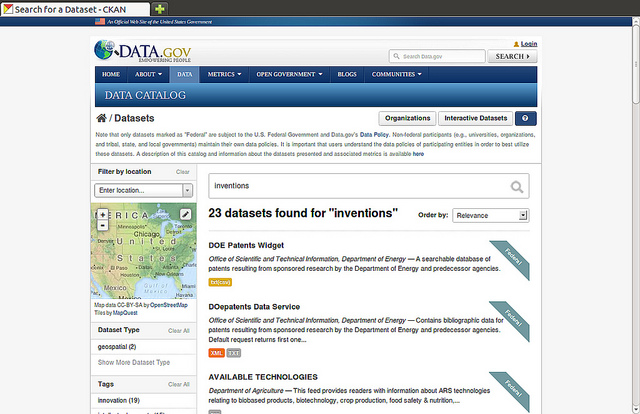

Data Portal
====================

Data Portal in DigitalHub relies on the :ref:`CKAN platform <ckan>`, an Open Source platform for making catalogs of open data, such as spredsheets, geospatial GeoJSON data, OData, etc.

CKAN functionality allows the data providers to manage and publsih collections of data. Each data collection,
or dataset, may be provided with the necessary metadata regarding the data structure, attributes, formats, updates, etc.

Once the data is published, users can use its faceted search features to browse and find the data they need, and preview it using maps, graphs and tables - whether they are developers, 
journalists, researchers, NGOs, or citizens.

An important fature of CKAN is the extensibility, which allows one to create new module
to deal with the specific data types and formats (e.g., OData, STA), visualization tools or widgets,
data validation tools, authentication, etc. 

Using CKAN, the community can access the data made available by the DigitalHub platform, e.g., GeoServer, DSS, API Manager. The data may be exposed 
in a public or protected manner, using the security features provided by AAC on top of the 

