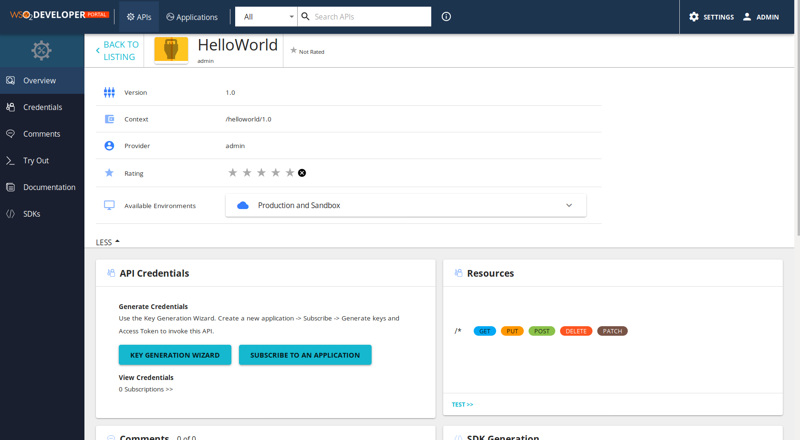

Service Portal
====================

Service Portal in DigitalHub relies on the API Store component of the :ref:`API Manager <apim>`.

The Opem Service exposed in ServiceHub through API Manager component are made
avaiable to the community via the API Store, where the APIs are 
devidied across tenants and categorized. Through the store the API consuners may
reference the API documentation, both formal (e.g., service interface definitions in Open API specification),
and informal (e.g., tutorials, descriptions, wikis, etc), comment and rate the API,
and even subscribe the APIs and test them directly. Furthermore, the API store Portal 
allows for 

- downloading the autogenerated API SDK libraries,
- manage credentials for accessing the APIs
- collect statistics of the usage of the subscribed client app.

Further details on configuring and using the API Store portal are available :ref:`here <apim>`.

