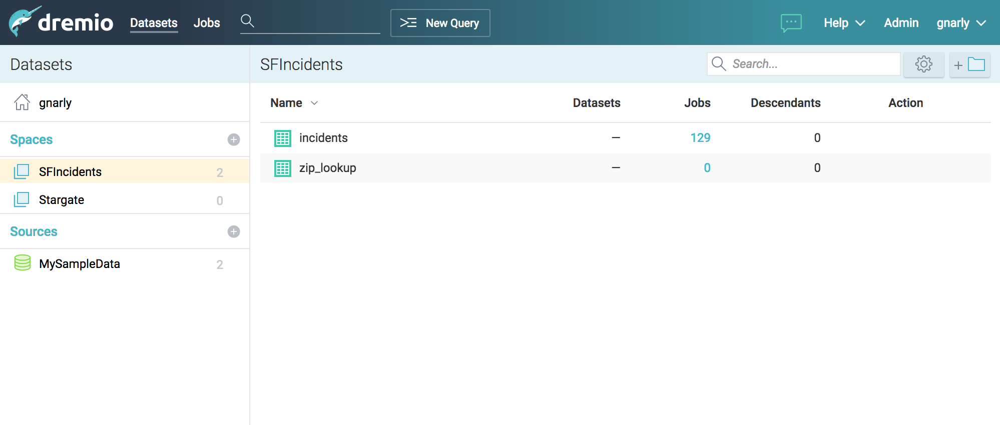
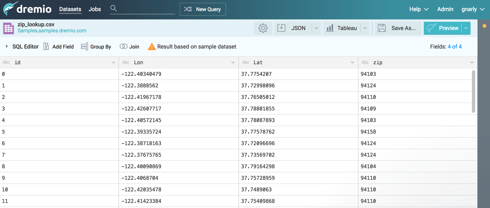
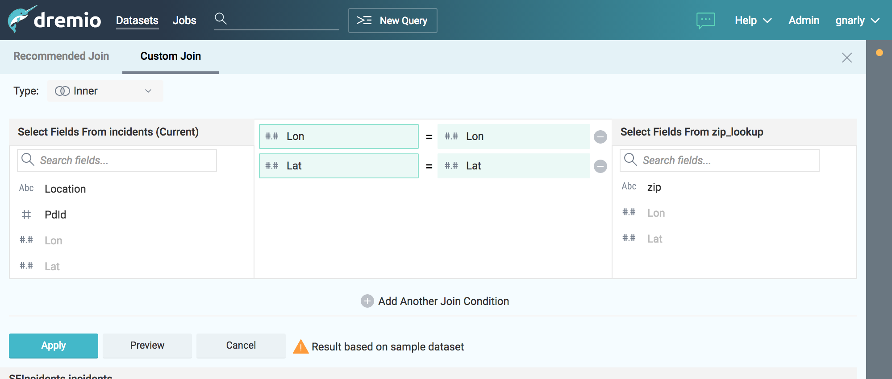
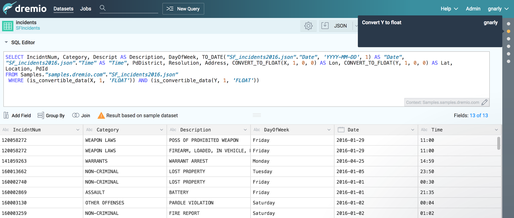

Dremio
==========================================

Dremio is a *Data-as-a-Service* platform, which enables data analysts and scientists to autonomously explore, 
validate and curate data from a variety of sources, all in a single, unified and coherent interface. 
Built for teams, Dremio leverages spaces and virtual datasets to offer a data platform with the following features.

The official website is https://www.dremio.com.

The official documentation with details on how to use Dremio is https://docs.dremio.com/.

Data Sources
------------------------------------------
Dremio supports modern data lakes built on a variety of different systems and provides:

- native integrations with major RDBMS such as PostgresSQL, MySQL, MS SQL, IBM DB2, Oracle
- NoSQL integration for modern datastores as MongoDB, Elasticsearch
- support for file based datasources, cloud storage systems, NAS

Data Exploration
------------------------------------------
Dremio offers a unified view across all datasets connected to the platform, with:

- live data visualization during query preparation and execution, with dynamic previews
- optimized query pushdown for all sources in native query language
- virtual datasets based on complex queries available as sources for analytics and external tools

Cloud Ready
------------------------------------------
Dremio is architected for cloud environments, with elastic computing abilities and dynamic horizontal scaling. 
Data reflections can be stored into distributed storage platforms such as *S3*, *HDFS*, *ADLS*.

Screenshots from the Website
------------------------------------------

Installation
------------------------------------------
Dremio is a Java software and requires a compatible JDK installed. The current version supports 
only ``OpenJDK 1.8`` and ``Oracle JDK 1.8``.

System requirements are:

- a supported Linux distribution: ``RHEL/CentOS 6.7+/7.3+``, ``SLES 12+``, ``Ubuntu 14.04+``, ``Debian 7+``
- at least ``4 CPU cores`` and ``8GB RAM`` for starting the software.

Given the nature of data analysis, and the distributed design of the software, production deployments 
should follow the following indications:

=============== ===============================
Node role       Hardware required
=============== ===============================
Coordinators    8 CPU/16GB RAM recommended
Executors       4 CPU/16GB RAM minimum
                16 CPU/64GB RAM recommended
=============== ===============================

You can read more at https://docs.dremio.com/deployment/rpm-tarball-install.html.

Platform Fork
------------------------------------------
The integration of Dremio into the Digital Hub platform required extending the open source version, 
which lacks some enteprise features, to support:

- **external user authentication** via OAuth2.0 and OpenID Connect
- **multitenancy** (see `Multitenancy and Organizational Model <https://digitalhub.readthedocs.io/en/latest/docs/architecture.html#multitenancy-and-organizational-model>`_)

Without these extensions, Dremio supports internal authentication only and grants administrator privileges to all users, 
hence every user can access any resource indiscriminately.

As far as **authentication** is concerned, the following features have been implemented:

- OAuth2.0 support, with access via the secure *authorization_code* flow and a native Dremio token integration for UI
- authomatic user creation and personal space (user home) definition upon valid OAuth2.0 access
- distinction between ADMIN role and USER role, which reflects on the UI in that admin actions and menus are hidden to unprivileged users
- OAuth2.0 login in the UI

Additionally, the upstream support service, which exposes metrics, interactive chat and debug information to dremio.com 
for licensed enterprise environments, is disabled by default. This should be reviewed in privacy-sensitive environments, 
as the complete deactivation of user and session data leakage to dremio.com and its partners requires the explicit 
configuration of various properties in ``dremio.conf``.

The **multitenancy model** implemented in the fork is structured as follows:

- admin privileges are not assignable, ADMIN (Dremio admin or system admin) role is reserved to ``dremio`` user, every other user is assigned either TENANT ADMIN role or USER role
- each user is associated to a single tenant
- the tenant is attached to the username with the syntax ``<username>@<tenant>``
- all APIs accessible to regular users are protected so that non-ADMIN users can only access resources within their own tenant
- when a resource belongs to a tenant (i.e. is shared among all its users), such tenant is specified as a prefix in the resource path with the syntax ``<tenant>__<rootname>/path/to/resource``

In Dremio, resources are either containers (spaces, sources, homes) or inside a container (folders, datasets), therefore 
spaces and sources are prefixed with their tenant, while folders and datasets inherit it from their container, which is 
the root of their path, and do not need to be prefixed. For example, in the following resource tree, ``myspace``, ``myfolder`` 
and ``mydataset`` all belong to ``mytenant``:

::

    mytenant__myspace
    └───myfolder
        └───mydataset

The ADMIN user can access any resource. Regular users (i.e. tenant admins and users) can only access resources inside their own home or belonging to their tenant. 
This implies that users can only query data and access job results according to these constraints.

.. note::
    Currently, when non-ADMIN users create a new source or space (sample sources included), that is **automatically prefixed** with their own tenant. 
    Non-ADMIN users cannot create sources or spaces with a different tenant than their own.

Configuration for OAuth2.0
------------------------------------------

.. note::
    The configuration described below uses `AAC <https://digitalhub.readthedocs.io/en/latest/docs/service/aac.html>`_ 
    as the authentication provider, however any standard OAuth2.0 provider can be used.

1. Configuring a client application on AAC
^^^^^^^^^^^^^^^^^^^^^^^^^^^^^^^^^^^^^^^^^^
On your AAC instance, create a new client app named ``dremio`` with the following properties:

- redirect web server URLs: ``<dremio_url>/apiv2/oauth/callback``
- grant types: ``Authorization Code``
- enabled identity providers : ``internal``
- enabled scopes: ``openid, profile, email, user.roles.me``

Under "Roles & Claims", set:

- unique role spaces: ``components/dremio``
- role prefix filters: ``components/dremio``
- custom claim mapping function:

.. code-block:: javascript

    function claimMapping(claims) {
        var valid = ['ROLE_USER'];
        var owner = ['ROLE_OWNER']
        var prefix = "components/dremio/";

        if (claims.hasOwnProperty("roles") && claims.hasOwnProperty("space")) {
            var space = claims['space'];
            //can't support no space selection performed
            if (Array.isArray(claims['space'])) {
                space = null;
            }
            //lookup for policy for selected space
            var tenant = null;
            if(space !== null) {
                for (ri in claims['roles']) {
                    var role = claims['roles'][ri];
                    if (role.startsWith(prefix + space + ":")) {
                        var p = role.split(":")[1]
                        
                        //replace owner with USER
                        if (owner.indexOf(p) !== -1) {
                            p = "ROLE_USER"
                        }

                        if (valid.indexOf(p) !== -1) {
                            tenant = space
                            break;
                        }
                    }
                }
            }

            if (tenant != null) {
                tenant =  tenant.replace(/\./g,'_')
                claims["dremio/tenant"] = tenant;
                claims["dremio/username"] = claims['username']+'@'+tenant;
                claims["dremio/role"] = "admin";
            } 
        }

        return claims;
    }

This function adds a custom claim holding a single user tenant, as AAC supports users being associated to multiple tenants 
while Dremio does not (see https://github.com/scc-digitalhub/AAC#53-services-scopes-and-claims). During the authorization 
step on AAC, the user will be asked to select which tenant to use.

2. Configuring Dremio
^^^^^^^^^^^^^^^^^^^^^^^^^^^^^^^^^^^^^^^^^^
Open your ``dremio.conf`` file and add the following configuration:

.. code-block:: javascript

    services.coordinator.web.auth: {
        type: "oauth",
        oauth: {
            authorizationUrl: "<aac_url>/eauth/authorize"
            tokenUrl: "<aac_url>/oauth/token"
            userInfoUrl: "<aac_url>/userinfo"
            callbackUrl: "<dremio_url>"
            clientId: "<your_client_id>"
            clientSecret: "<your_client_secret>"
            tenantField: "dremio/tenant"
            scope: "openid profile email user.roles.me"
            roleField: "dremio/role"
        }
    }

The ``tenantField`` property matches the claim defined in the function above, which holds the user tenant selected during 
the login. Dremio will associate it to the username with the syntax ``<username>@<tenant>``. That will be used as username in Dremio.

The ``roleField`` property matches another claim defined in the function, which holds the role of the user (either "user" or "admin") 
within the selected tenant. Such roles correspond to READ and WRITE privileges over tenant data.

Additionally, to fully disable dremio.com intercom, add also:

.. code-block:: javascript

    services.coordinator.web.ui {
        intercom: {
            enabled: false
            appid:  ""
        }
    }

Building from Source
------------------------------------------
Dremio is a *maven* project, and as such can be properly compiled, along with all the dependencies, via the usual ``mvn`` commands:

::

    mvn clean install

Since some modules require license acceptance and checks, in automated builds it is advisable to skip those checks to avoid a failure:

::

    mvn clean install -DskipTests -Dlicense.skip=true 

The ``skipTests`` flag is useful to speed up automated builds, for example for Docker container rebuilds, once the CI has 
properly executed all the tests.

During development of new modules or modifications, it is advisable to disable the *style-checker* via the ``-Dcheckstyle.skip`` flag. 
In order to build a single module, for example *dremio-common*, use the following syntax:

::

    mvn clean install -DskipTests -Dlicense.skip=true -Dcheckstyle.skip -pl :dremio-common

To test the build, you can execute only the *distribution* module, which will produce a complete distribution tree 
under the ``distribution/server/target`` folder, and a **tar.gz** with the deployable package named *dremio-community-{version}-{date}-{build}*, 
for example ``./distribution/server/target/dremio-community-3.2.1-201905191350330803-1a33f83.tar.gz``.

::

    mvn clean install -DskipTests -Dlicense.skip=true -pl :dremio-distribution

The resulting archive can be installed as per upstream instructions.

.. note::
    The first time you open Dremio, you will be asked to create an administrator account. 
    The admin user **must** have the username ``dremio``, as that is currently the only user that can have admin privileges.

Additional Changes in the Fork
------------------------------------------

Source Management
^^^^^^^^^^^^^^^^^^^^^^^^^^^^^^^^^^^^^^^^^^
Differently from the original implementation, in which source management was restricted to ADMIN only, users with 
TENANT ADMIN role are allowed to manage (create, update and delete) sources in addition to spaces *within their tenant*, 
while the other users can only manage spaces.

Arrow Flight and ODBC/JDBC Services
^^^^^^^^^^^^^^^^^^^^^^^^^^^^^^^^^^^^^^^^^^

While internal users can use their credentials to connect to Dremio Arrow Flight server endpoint and ODBC and JDBC services, 
users that log in via OAuth need to set an internal password in order to connect to Dremio with some client. 
Such password can be set in the Dremio UI on the Account Settings page.

Connecting WSO2 DSS to Dremio via JDBC
------------------------------------------
The fork includes an `OSGi bundle <https://github.com/scc-digitalhub/dremio-oss/tree/multitenancy/bundle>`_ for Dremio JDBC Driver 
that can be used with WSO2 Data Services Server. In order to use it, copy the JAR file to <DSS_PRODUCT_HOME>/repository/components/dropins 
and restart DSS.

DSS Datasource Configuration
^^^^^^^^^^^^^^^^^^^^^^^^^^^^^^^^^^^^^^^^^^
A DSS data source can be connected to Dremio by configuring the following properties:

- Datasource Type: ``RDBMS``
- Database Engine: ``Generic``
- Driver Class: ``com.dremio.jdbc.Driver``
- URL: ``jdbc:dremio:direct=localhost:31010``
- User Name: ``<dremio_username>``
- Password: ``<dremio_password>``

When you create a datasource that connects to Dremio, you will likely get a warning on the DSS console that a default logger 
will be used for the driver logs.

Dremio APIs
------------------------------------------
Many features of Dremio are available via the Dremio REST API. Two versions of the API currently coexist:

- v2 is still used internally, although it should be dismissed in the future
- v3 is documented on the Dremio docs as the official REST API and is progressively replacing v2 also internally

Here is a collection of all the **v3 endpoints** with links to the corresponding Dremio docs pages, if any. Note that 
access to some stats APIs has been restricted to ADMIN (i.e. Dremio system admin) in the fork, while regular users 
have been granted access to source management APIs (if they are tenant admins). The required permission is marked 
in **bold** in the tables whenever it differs from the official documentation.

The API path is ``<dremio_url>/api/v3``.

**Catalog API**:

+----------------------------------+--------+--------------------------------------------------------------------------+------------+
| Path                             | Method | Docs                                                                     | Permission |
+==================================+========+==========================================================================+============+
| /catalog                         | GET    | https://docs.dremio.com/rest-api/catalog/get-catalog.html                | user       |
+                                  +--------+--------------------------------------------------------------------------+------------+
|                                  | POST   | https://docs.dremio.com/rest-api/catalog/post-catalog.html               | user       |
+----------------------------------+--------+--------------------------------------------------------------------------+------------+
| /catalog/{id}                    | GET    | https://docs.dremio.com/rest-api/catalog/get-catalog-id.html             | user       |
+                                  +--------+--------------------------------------------------------------------------+------------+
|                                  | POST   | https://docs.dremio.com/rest-api/catalog/post-catalog-id.html            | user       |
+                                  +--------+--------------------------------------------------------------------------+------------+
|                                  | PUT    | https://docs.dremio.com/rest-api/catalog/put-catalog-id.html             | user       |
+                                  +--------+--------------------------------------------------------------------------+------------+
|                                  | DELETE | https://docs.dremio.com/rest-api/catalog/delete-catalog-id.html          | user       |
+----------------------------------+--------+--------------------------------------------------------------------------+------------+
| /catalog/{id}/refresh            | POST   | https://docs.dremio.com/rest-api/catalog/post-catalog-id-refresh.html    | user       |
+----------------------------------+--------+--------------------------------------------------------------------------+------------+
| /catalog/{id}/metadata/refresh   | POST   | Refresh of physical dataset metadata                                     | user       |
+----------------------------------+--------+--------------------------------------------------------------------------+------------+
| /catalog/by-path/{path}          | GET    | https://docs.dremio.com/rest-api/catalog/get-catalog-path.html           | user       |
+----------------------------------+--------+--------------------------------------------------------------------------+------------+
| /catalog/search                  | GET    | Item research given a query string                                       | user       |
+----------------------------------+--------+--------------------------------------------------------------------------+------------+
| /catalog/{id}/collaboration/tag  | GET    | https://docs.dremio.com/rest-api/catalog/get-catalog-collaboration.html  | user       |
+                                  +--------+--------------------------------------------------------------------------+------------+
|                                  | POST   | https://docs.dremio.com/rest-api/catalog/post-catalog-collaboration.html | user       |
+----------------------------------+--------+--------------------------------------------------------------------------+------------+
| /catalog/{id}/collaboration/wiki | GET    | https://docs.dremio.com/rest-api/catalog/get-catalog-collaboration.html  | user       |
+                                  +--------+--------------------------------------------------------------------------+------------+
|                                  | POST   | https://docs.dremio.com/rest-api/catalog/post-catalog-collaboration.html | user       |
+----------------------------------+--------+--------------------------------------------------------------------------+------------+

**Reflection API**:

+-----------------------------------------+--------+---------------------------------------------------------------------+------------+
| Path                                    | Method | Docs                                                                | Permission |
+=========================================+========+=====================================================================+============+
| /reflection                             | POST   | https://docs.dremio.com/rest-api/reflections/post-reflection.html   | user       |
+-----------------------------------------+--------+---------------------------------------------------------------------+------------+
| /reflection/{id}                        | GET    | https://docs.dremio.com/rest-api/reflections/get-reflection-id.html | user       |
+                                         +--------+---------------------------------------------------------------------+------------+
|                                         | PUT    | https://docs.dremio.com/rest-api/reflections/put-reflection.html    | user       |
+                                         +--------+---------------------------------------------------------------------+------------+
|                                         | DELETE | https://docs.dremio.com/rest-api/reflections/delete-reflection.html | user       |
+-----------------------------------------+--------+---------------------------------------------------------------------+------------+
| /dataset/{id}/reflection                | GET    | Reflections used on a dataset                                       | user       |
+-----------------------------------------+--------+---------------------------------------------------------------------+------------+
| /dataset/{id}/reflection/recommendation | POST   | Reflections recommended for a dataset                               | user       |
+-----------------------------------------+--------+---------------------------------------------------------------------+------------+

**Job API**:

+--------------------------------------------+--------+-----------------------------------------------------+------------+
| Path                                       | Method | Docs                                                | Permission |
+============================================+========+=====================================================+============+
| /job/{id}                                  | GET    | https://docs.dremio.com/rest-api/jobs/get-job.html  | user       |
+--------------------------------------------+--------+-----------------------------------------------------+------------+
| /job/{id}/results                          | GET    | https://docs.dremio.com/rest-api/jobs/get-job.html  | user       |
+--------------------------------------------+--------+-----------------------------------------------------+------------+
| /job/{id}/cancel                           | POST   | https://docs.dremio.com/rest-api/jobs/post-job.html | user       |
+--------------------------------------------+--------+-----------------------------------------------------+------------+
| /job/{id}/reflection/{reflectionId}        | GET    | Retrieval of a reflection job status                | user       |
+--------------------------------------------+--------+-----------------------------------------------------+------------+
| /job/{id}/reflection/{reflectionId}/cancel | POST   | Cancellation of a running reflection job            | user       |
+--------------------------------------------+--------+-----------------------------------------------------+------------+

**SQL API**:

+------+--------+----------------------------------------------------+------------+
| Path | Method | Docs                                               | Permission |
+======+========+====================================================+============+
| /sql | POST   | https://docs.dremio.com/rest-api/sql/post-sql.html | user       |
+------+--------+----------------------------------------------------+------------+

**User API**:

+----------------------+--------+-----------------------------------------------------+------------+
| Path                 | Method | Docs                                                | Permission |
+======================+========+=====================================================+============+
| /user                | POST   | User creation                                       | admin      |
+----------------------+--------+-----------------------------------------------------+------------+
| /user/{id}           | GET    | https://docs.dremio.com/rest-api/user/get-user.html | user       |
+                      +--------+-----------------------------------------------------+------------+
|                      | PUT    | User update                                         | user       |
+----------------------+--------+-----------------------------------------------------+------------+
| /user/by-name/{name} | GET    | https://docs.dremio.com/rest-api/user/get-user.html | user       |
+----------------------+--------+-----------------------------------------------------+------------+

**Cluster Statistics API**:

+----------------+--------+-------------------------------------------+------------+
| Path           | Method | Docs                                      | Permission |
+================+========+===========================================+============+
| /cluster/stats | GET    | Stats about sources, jobs and reflections | **admin**  |
+----------------+--------+-------------------------------------------+------------+

**Job Statistics API**:

+-------------------+--------+-------------------------------------------------------+------------+
| Path              | Method | Docs                                                  | Permission |
+===================+========+=======================================================+============+
| /cluster/jobstats | GET    | Stats about the number of jobs per type over ten days | **admin**  |
+-------------------+--------+-------------------------------------------------------+------------+

**User Statistics API**:

+-------------+--------+---------------------------+------------+
| Path        | Method | Docs                      | Permission |
+=============+========+===========================+============+
| /stats/user | GET    | Stats about user activity | **admin**  |
+-------------+--------+---------------------------+------------+

**Info API**:

+-------+--------+--------------------------------+------------+
| Path  | Method | Docs                           | Permission |
+=======+========+================================+============+
| /info | GET    | Basic information about Dremio | user       |
+-------+--------+--------------------------------+------------+

**Source API** (deprecated in favour of Catalog API, will be removed):

+---------------------+--------+-------------------------------------------------------------+------------+
| Path                | Method | Docs                                                        | Permission |
+=====================+========+=============================================================+============+
| /source             | GET    | https://docs.dremio.com/rest-api/sources/get-source.html    | user       |
+                     +--------+-------------------------------------------------------------+------------+
|                     | POST   | https://docs.dremio.com/rest-api/sources/post-source.html   | **user**   |
+---------------------+--------+-------------------------------------------------------------+------------+
| /source/{id}        | GET    | https://docs.dremio.com/rest-api/sources/get-source.html    | user       |
+                     +--------+-------------------------------------------------------------+------------+
|                     | PUT    | https://docs.dremio.com/rest-api/sources/put-source.html    | **user**   |
+                     +--------+-------------------------------------------------------------+------------+
|                     | DELETE | https://docs.dremio.com/rest-api/sources/delete-source.html | **user**   |
+---------------------+--------+-------------------------------------------------------------+------------+
| /source/type        | GET    | https://docs.dremio.com/rest-api/sources/source-types.html  | **user**   |
+---------------------+--------+-------------------------------------------------------------+------------+
| /source/type/{name} | GET    | https://docs.dremio.com/rest-api/sources/source-types.html  | **user**   |
+---------------------+--------+-------------------------------------------------------------+------------+
