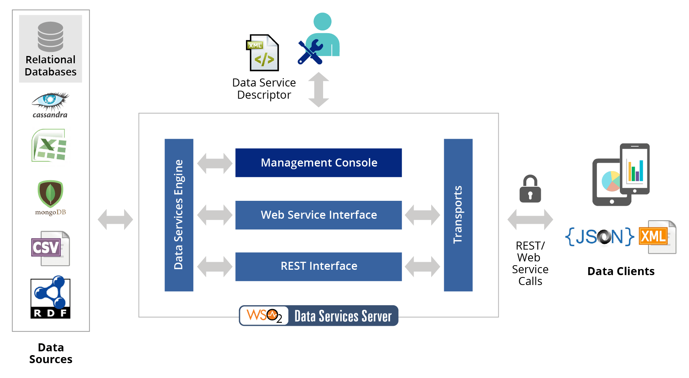

Data Services Server (WSO2)
===========================

Behind most applications are heterogeneous data stores. 
Most businesses require secure and managed data access across these federated data stores, data service transactions, data transformation, and validation. 
An organization's data exposed as a service, decoupled from the infrastructure where it is stored is called data services in service-oriented architecture (SOA).

Data services provide a convenient mechanism to configure a Web service interface for data in various datasources such as relational databases, CSV files, Microsoft Excel sheets, Google spreadsheets etc.
These data services provide unprecedented data access and straightforward integration with business processes, mashups, gadgets, business intelligence, and mobile applications. 

WSO2 Data Services Server augments service-oriented architecture development efforts by providing an easy-to-use platform 
for integrating data stores, creating composite data views, and hosting data services. 
It supports secure and managed data access across federated data stores, data service transactions, 
and data transformation and validation using a lightweight, developer friendly, agile development approach. 
It provides federation support, combining data from multiple sources in single response or resource 
and also supports nested queries across data sources.
WSO2 Data Services Server is based on Java OSGi technology, which allows components to be dynamically 
installed, started, stopped, updated, and uninstalled while eliminating component version conflicts.

.. toctree::
  dss_install
  dss_usage
  dss_rest_crud
  dss_deploy

