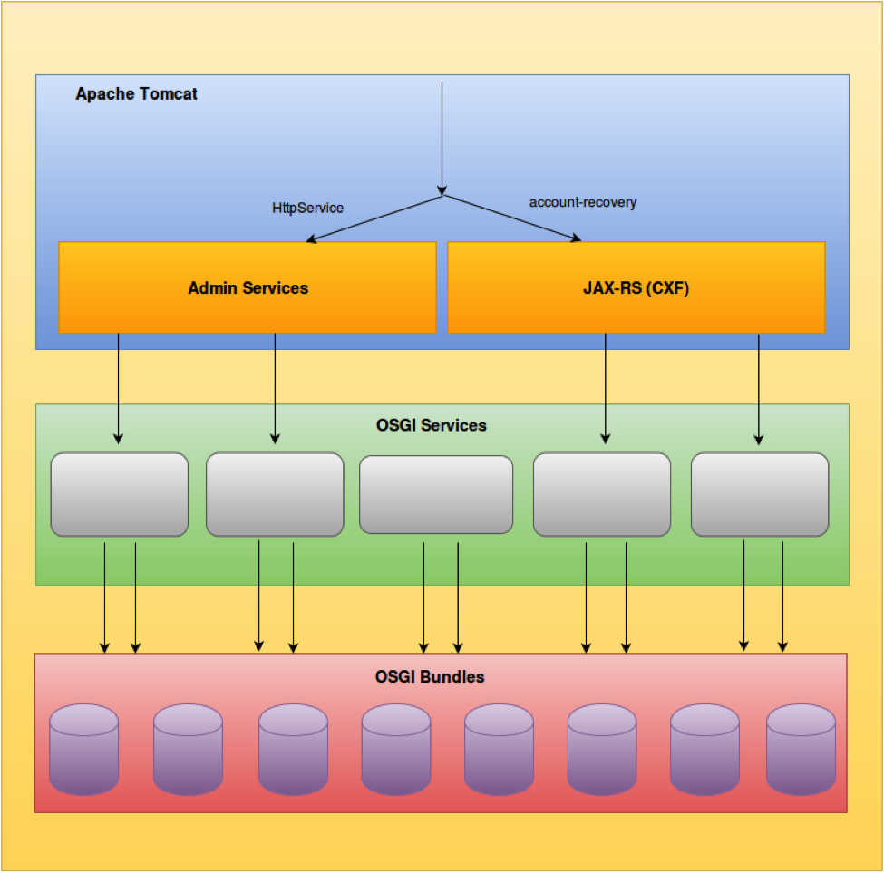

REST API for dataservices CRUD
===============================

1. REST API Usage
-----------------

| All the list of webservices is exposed in the following endpoint: ``https://mydomain.com/dss_proxy_context_path/rest/`` 
| They are protected by OAuth2 token-based authentication method, therefore the token must be provided in the Header or it can be used the apikey as a query parameter. 
| The API can be accesed also by using ``Basic Authorization Header : Basic base64Encode(username:password)``

1.1. Save dataservice
^^^^^^^^^^^^^^^^^^^^^^
To save or update the configuration of one dataservice inside specific tenant the following call should be performed: ::

	POST /{tenantDomain}/saveDataService    HTTPS/1.1 
	Accept: application/json 
	Host: https://mydomain.com/dss_proxy_context_path/rest/
	a. Authorization: Bearer <token-value>  
	b. ApiKey query param https://wso2server.com/dss/rest/{tenantDomain}/saveDataService?apikey=APIKEY_VALUE
	
1.2. Get dataservice configuration
^^^^^^^^^^^^^^^^^^^^^^^^^^^^^^^^^^
To get the configuration of one dataservice inside specific tenant the following call should be performed: ::

	GET /{tenantDomain}/getDataService?serviceid=DATASERVICENAME    HTTPS/1.1 
	Host: https://mydomain.com/dss_proxy_context_path/rest
	a. Authorization: Bearer <token-value>  
	b. ApiKey query param https://wso2server.com/dss/rest/{tenantDomain}/getDataService?serviceid=DATASERVICENAME&apikey=APIKEY_VALUE

1.3. Get list of dataservices
^^^^^^^^^^^^^^^^^^^^^^^^^^^^^
To filter the list of dataservices inside specific tenant is important to provide the term you want to search and also provide the page number starting from 0. 
The following call should be performed: ::

	GET /{tenantDomain}/listDataService?search=TERM_TO_SEARCH&page=0    HTTPS/1.1 
	Host: https://mydomain.com/dss_proxy_context_path/rest
	Accept: application/json 
	a. Authorization: Bearer <token-value>  
	b. ApiKey query param https://wso2server.com/dss/rest/{tenantDomain}/listDataService?search=TERM_TO_SEARCH&page=0&apikey=APIKEY_VALUE

1.4. Delete dataservice
^^^^^^^^^^^^^^^^^^^^^^^
To delete one dataservice inside specific tenant the following call should be performed: ::

	DELETE /{tenantDomain}/dataService/DATASERVICENAME    HTTPS/1.1 
	Host: https://mydomain.com/dss_proxy_context_path/rest
	a. Authorization: Bearer <token-value>  
	b. ApiKey query param https://wso2server.com/dss/rest/{tenantDomain}/dataService/DATASERVICENAME&apikey=APIKEY_VALUE
	
Consider the fact that you can delete a dataservice that could be placed inside specific folder,in that case you can provide the exact value: ``/dataService/FOLDERNAME/DATASERVICENAME``

Technical implementation
^^^^^^^^^^^^^^^^^^^^^^^^^
All WSO2 products expose their management functionality as admin services, which are SOAP services. 
| In this fork of carbon.data we have exposed OSGi-level functionalities as REST APIs via JAX-RS web application. 

In order to expose a SOAP-based admin service as a REST API there are several tasks that need to be done: 

* Create DataServiceManager packages to be integrated inside carbon.data OSGi bundles.
* Create Jax-RS WebApp in order to provide the REST API that is going to consume the OSGi service.
* Provide multitenancy data services creation through the API, extend admin services in order to switch the AxisConfiguration according to current PrivilegedCarbonContext.
* Integrate the OAUTH2 security filter in order to allow only authorized access to the REST API for dataservices CRUD.
* Integrate the Basic Auth security filter in order to allow only authorized access to the REST API for dataservices CRUD.
