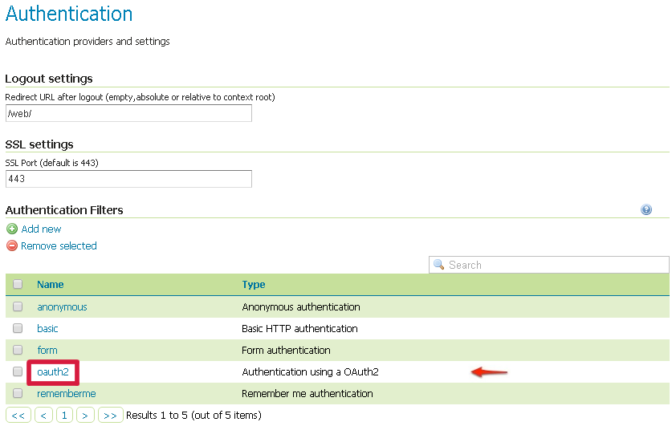

GeoServer
======================

| GeoServer is an open source software server written in Java that allows users to share and edit geospatial data. 
| Designed for interoperability, it publishes data from any major spatial data source using open standards.
| GeoServer is the reference implementation of the Open Geospatial Consortium (OGC) Web Feature Service (WFS) and Web Coverage Service (WCS) standards, as well as a high performance certified compliant Web Map Service (WMS). GeoServer forms a core component of the Geospatial Web.
In order to manage the configuration, Geoserver provides:
	* an interactive interface (via the `web admin interface <https://docs.geoserver.org/latest/en/user/webadmin/index.html#web-admin>`_) 
	* a programmatic interface (through the `REST API <https://docs.geoserver.org/latest/en/user/rest/index.html#rest>`_) 

Installation
--------------

1. GeoServer requires a Java 8 environment (JRE) to be installed on your system.You can download `JRE 8 from Oracle <https://www.oracle.com/technetwork/java/javase/downloads/index.html>`_.

	.. note::
		Note Java 9 is not currently supported.

2. Select the version of GeoServer that you wish to `download <http://geoserver.org/download/>`_. If you’re not sure, select `Stable <http://geoserver.org/release/stable/>`_.

3. Select Platform Independent Binary on the download page.

4. Download the archive and unpack to the directory where you would like the program to be located.

	.. note::
		Note A suggested location would be /usr/share/geoserver.

5. Add an environment variable to save the location of GeoServer by typing the following command: ::

	echo "export GEOSERVER_HOME=/usr/share/geoserver" >> ~/.profile
	. ~/.profile
6. Make yourself the owner of the geoserver folder. Type the following command in the terminal window, replacing USER_NAME with your own username : ::

	sudo chown -R USER_NAME /usr/share/geoserver/
7. Start GeoServer by changing into the directory geoserver/bin and executing the startup.sh script: ::

	cd geoserver/bin
	sh startup.sh
8. In a web browser, navigate to http://localhost:8080/geoserver.

If you see the GeoServer logo, then GeoServer is successfully installed.

.. image:: ../assets/geoserver/success.png

Services
----------

| OGC services are the primary method of publishing data in GeoServer.
| GeoServer serves data using standard protocols established by the `Open Geospatial Consortium <https://www.opengeospatial.org/>`_:
| These services are the primary way that GeoServer supplies geospatial information.

* `Web Map Service (WMS) <https://docs.geoserver.org/latest/en/user/services/wms/index.html>`_ - GeoServer provides support for Open Geospatial Consortium (OGC) Web Map Service (WMS) versions 1.1.1 and 1.3.0. This is the most widely used standard for generating maps on the web, and it is the primary interface to request map products from GeoServer. Using WMS makes it possible for clients to overlay maps from several different sources in a seamless way. It supports requests for map images (and other formats) generated from geographical data.
* `Web Feature Service (WFS) <https://docs.geoserver.org/latest/en/user/services/wfs/index.html>`_ - GeoServer provides support for the Open Geospatial Consortium (OGC) Web Feature Service (WFS) specification, versions 1.0.0, 1.1.0, and 2.0.0. WFS defines a standard for exchanging vector data over the Internet. With a compliant WFS, clients can query both the data structure and the source data.It supports requests for geographical feature data (with vector geometry and attributes).
* `Web Coverage Service (WCS) <https://docs.geoserver.org/latest/en/user/services/wcs/index.html>`_ - is a standard created by the OGC that refers to the receiving of geospatial information as ‘coverages’ (rasters): digital geospatial information representing space-varying phenomena. One can think of it as Web Feature Service (WFS) for raster data. It gets the ‘source code’ of the map, but in this case its not raw vectors but raw imagery.An important distinction must be made between WCS and Web Map Service (WMS). They are similar, and can return similar formats, but a WCS is able to return more information, including valuable metadata and more formats. It additionally allows more precise queries, potentially against multi-dimensional backend formats.
* `Web Processing Service (WPS) <https://docs.geoserver.org/latest/en/user/services/wps/index.html>`_ -  is an OGC service for the publishing of geospatial processes, algorithms, and calculations. The WPS service is available as an extension for geoserver providing an execute operation for data processing and geospatial analysis.WPS is not a part of GeoServer by default, but is available as an extension. The main advantage of GeoServer WPS over a standalone WPS is direct integration with other GeoServer services and the data catalog. This means that it is possible to create processes based on data served in GeoServer, as opposed to sending the entire data source in the request. It is also possible for the results of a process to be stored as a new layer in the GeoServer catalog. In this way, WPS acts as a full remote geospatial analysis tool, capable of reading and writing data from and to GeoServer.
* `Catalog Services for the Web (CSW) <https://docs.geoserver.org/latest/en/user/services/csw/index.html>`_ - GeoServer supports retrieving and displaying items from the GeoServer catalog using the CSW service.

Data Management
-----------------

.. toctree::
  geoserver_data_mng

DigitalHub integration
------------------------

| The extended `authentication and authorization module <https://github.com/scc-digitalhub/sco.geoserver/tree/master/aac.provider#>`_ allows GeoServer to authenticate against the OAuth2 Protocol . 
| In order to let the module work, it’s mandatory to setup and configure both oauth2 and oauth2-aac extension. 
| The module is a sample extension for `AAC <https://digitalhub.readthedocs.io/en/latest/docs/service/aac.html>`_ OAuth2 Provider.
| This module contains the implementation of the GeoServer security filter, the base classes for the OAuth2 Token services and the GeoServer GUI panel.

1. Configure the AAC authentication provider
"""""""""""""""""""""""""""""""""""""""""""""

The first thing to do is to configure the AAC OAuth2 Provider and obtain Client ID and Client Secret keys.
Refer to the `AAC <https://digitalhub.readthedocs.io/en/latest/docs/service/aac.html>`_ documentation for related detailed configurations.

2. Configure the GeoServer OAuth2 filter
"""""""""""""""""""""""""""""""""""""""""

1. Start GeoServer and login to the web admin interface as the admin user (default: admin/geoserver).

2. Click the Authentication link located under the Security section of the navigation sidebar.

.. image:: ../assets/geoserver/filter1.jpg
	:height: 300px

3. Scroll down to the Authentication Filters panel and click the Add new link.

.. image:: ../assets/geoserver/filter2.jpg
	:height: 300px

4. Click the OAuth2 link.

5. Fill in the fields of the settings form as follows: ::

	"Enable Redirect Authentication EntryPoint" = False
	"Access Token URI" = https://AAC_URL/oauth2/token
	"User Authorization URI" = http://AAC_URL/eauth/authorize
	"Redirect URI" = http://localhost:8080/geoserver
	"Check Token Endpoint URL" = http://AAC_URL/resources/token
	"Logout URI" = http://AAC_URL/logout?target=http://localhost:8080/geoserver
	"Scopes" = profile.basicprofile.me profile.accountprofile.me user.roles.me user.roles.read

6. Update the filter chains by adding the new OAuth2 filter.

Once everything has been configured you should be able to see the new oauth2 filter available among the Authentication Filters list.

| Through this it will be always possible to modify / update the filter options, or create more of them.
| The next step is to add the filter to the Filter Chains you want to protect with OAuth2 also

7.Select the OAuth2 Filter for each filter chain you want to protect with OAuth2.

If you need to protect all the GeoServer services and the GeoServer Admin GUI too with OAuth2, you need to add the oauth2 filter to all the following chains

* web
* rest
* gwc
* default

The order of the authentication filters depends basically on which method you would like GeoServer to try first.

	.. note::
		During the authentication process, the authentication filters of a Filter Chain are executed serially until one succeed (for more details please see the section `Authentication chain <https://docs.geoserver.org/latest/en/user/security/auth/chain.html#security-auth-chain>`_)

	.. image:: ../assets/geoserver/oauth2filter003.png

	.. note::
		Remember that the anonymous filter must be always the last one.

8. Save. It’s now possible to test the authentication

