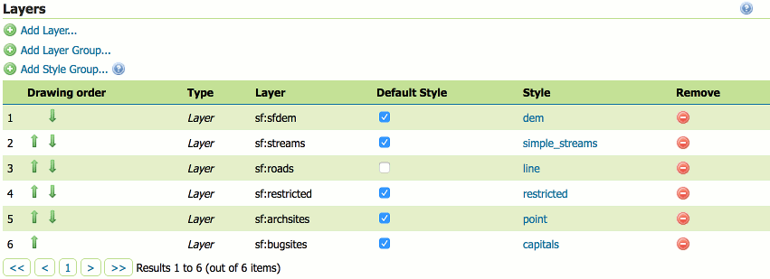

Data Settings
----------------

| GeoServer permits to connect, load and publish data from a wide variety of sources.
| Refer to the `official documentation <https://docs.geoserver.org/latest/en/user/data/index.html#data>`_ to learn how to use the GeoServer web interface to accomplish most common tasks, along with the different data formats served by GeoServer.

	.. note::
		Note There are many more data sources available through `Extensions <https://docs.geoserver.org/latest/en/user/extensions/index.html#extensions>`_ and `Community <https://docs.geoserver.org/latest/en/user/community/index.html#community>`_  modules. If you are looking for a specific data format and not finding it here, please check those sections.

Workspace
"""""""""""

| Analogous to a namespace, a workspace is a container which organizes other items. 
| In GeoServer, a workspace is often used to group similar layers together. 
| Layers may be referred to by their workspace name, colon, layer name (for example topp:states). Two different layers can have the same name as long as they belong to different workspaces (for example sf:states and topp:states).

	
.. image:: ../assets/geoserver/data_workspaces.png

Layers
"""""""""

| In GeoServer, the term “layer” refers to a raster or vector dataset that represents a collection of geographic features. 
| Vector layers are analogous to “featureTypes” and raster layers are analogous to “coverages”. 
| All layers have a source of data, known as a Store. The layer is associated with the Workspace in which the Store is defined.

| In the Layers section of the web interface, you can view and edit existing layers, add (register) a new layer, or remove (unregister) a layer. 
| The Layers View page displays the list of layers, and the Store and Workspace in which each layer is contained.

.. image:: ../assets/geoserver/data_layers.png

Stores
"""""""""

| A store connects to a data source that contains raster or vector data. 
| A data source can be a file or group of files, a table in a database, a single raster file, or a directory (for example, a Vector Product Format library). 
| The store construct allows connection parameters to be defined once, rather than for each dataset in a source. As such, it is necessary to register a store before configuring datasets within it.

.. image:: ../assets/geoserver/data_stores.png

| While there are many potential formats for data sources, there are only four kinds of stores. 
| For raster data, a store can be a file. For vector data, a store can be a file, database, or server.

Layer Groups
""""""""""""""

| A layer group is a container in which layers and other layer groups can be organized in a hierarchical structure. 
| A layer group can be referred to by a single name in WMS requests. 
| This allows simpler requests, as one layer can be specified instead of multiple individual layers. 
| A layer group also provides a consistent, fixed ordering of the layers it contains, and can specify alternate (non-default) styles for layers.

