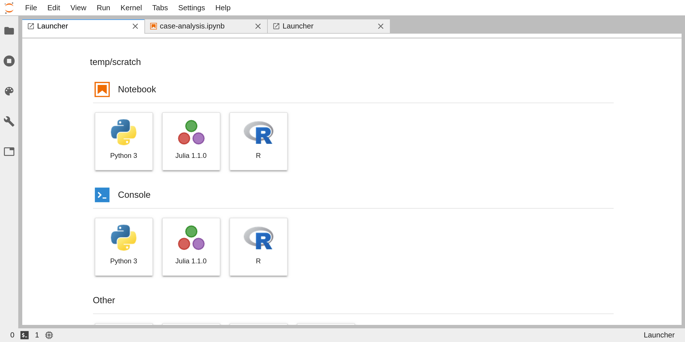
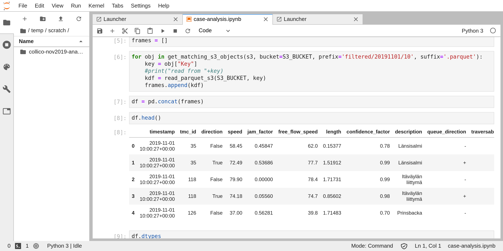
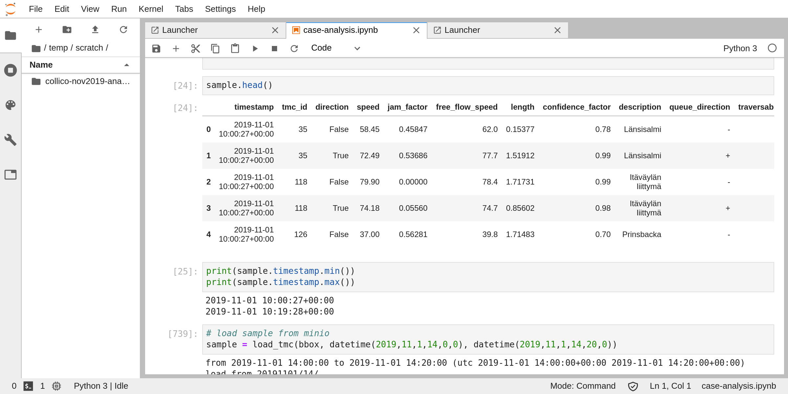
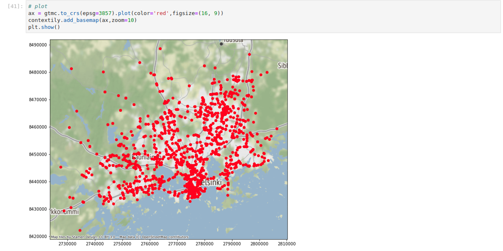

Jupyter Notebook
======================

Jupyter is an interactive data science and scientific computing notebook,
where users can create, edit and visualize rich documents containing a 
mix of code, with output, text, figures and interactive widgets.

Jupyter Notebooks offer a great, immediate and powerful way to interactively
develop data science and analysis projects 
in a variety of languages, such as Python, Java, Javascript, and at the same
time visualize and present the results. 

The intuitive workflow is based on a *REPL model (Read-Eval-Print-Loop)*,
a computing model that takes a single user input, such as an expression in a 
programming language, and evaluates (*i.e. executes the code*) the instructions within 
the current environment and return the result to the user.

The *Kernel* runs inside a backend and communicates with the *frontend UI* via network over a dedicated
protocol, which enables the Notebook to support different programming languages by switching the kernel.
The user interface is a web application, accessible via browser. 

This approach makes viable to work 
over the network leveraging cloud resources such as powerful servers and gpus to accelerate the work,
all while editing the script and visualizing the results interactively inside a local browser window.

License
----------
Project Jupyter (https://jupyter.org/) is an open-source project, born out of the IPython Project in 2014 
to support interactive data science and scientific computing across different programming languages.
The software is released under a modified BSD license.

Screenshots
-------------

Installation
---------------
The Jupyter notebook can be installed locally on a pc by using a *Python* package manager such as 
``pip`` or ``conda``. While Jupyter can run code in many languages, to install the application Python is a 
requirement.
Either one of the following instructions will install Jupyter:
::
    $ pip install jupyterlab

for *pip*, otherwise when using *conda* type:
::
    $ conda install -c conda-forge jupyterlab

(*see https://jupyter.readthedocs.io/en/latest/install.html*)

If the local environment does not provide the necessary packages, it is possible to leverage 
``anaconda`` to install everything required.
See https://jupyter.readthedocs.io/en/latest/install.html for detailed instructions.

Do note that all the libraries, packages and tools needed to execute the code will need
to be manually installed via the same package manager used to install ``jupyterlab``, to avoid inconsistencies 
and conflicts.

Alternatively, an easier, more modern and immediate way to experience Jupyter is to leverage ``docker`` to
run a local container with everything installed and pre-configured, ready to use.

Project Jupyter maintains a set of images with up-to-date dependencies and stacks, pre-configured for various 
scenarios such as 

* minimal-notebook
* scipy-notebook
* pyspark-notebook
* datascience-notebook
* tensorflow-notebook

and many others at DockerHub https://hub.docker.com/u/jupyter. 

See the complete guide at https://jupyter-docker-stacks.readthedocs.io/en/latest/using/selecting.html#jupyter-datascience-notebook.

Running a notebook is as easy as launching the chosen image and access via browser to the local URL as
detailed by the execution log 

.. code-block:: none

    $ docker run -p 8888:8888 jupyter/scipy-notebook:2c80cf3537ca

    Executing the command: jupyter notebook
    [I 15:33:00.567 NotebookApp] Writing notebook server cookie secret to /home/jovyan/.local/share/jupyter/runtime/notebook_cookie_secret
    [W 15:33:01.084 NotebookApp] WARNING: The notebook server is listening on all IP addresses and not using encryption. This is not recommended.
    [I 15:33:01.155 NotebookApp] Serving notebooks from local directory: /home/jovyan
    [I 15:33:01.156 NotebookApp] 0 active kernels
    [I 15:33:01.156 NotebookApp] The Jupyter Notebook is running at:
    [I 15:33:01.157 NotebookApp] http://[all ip addresses on your system]:8888/?token=112bb073331f1460b73768c76dffb2f87ac1d4ca7870d46a
    [I 15:33:01.157 NotebookApp] Use Control-C to stop this server and shut down all kernels (twice to skip confirmation).
    [C 15:33:01.160 NotebookApp]

    Copy/paste this URL into your browser when you connect for the first time,
    to login with a token:
        http://localhost:8888/?token=112bb073331f1460b73768c76dffb2f87a

For further instructions see https://jupyter-docker-stacks.readthedocs.io/en/latest/index.html.

JupyterHub
----------------

JupyterHub is a project aimed at bringing the Jupyter Notebook to groups of users,
without the need to install it locally. Thanks to the hub, users are able to 
access, over the network, a dedicated instance hosted on a shared computational environment.

Every kind of user, from students to researchers and data scientists, can get their work done
in their own dedicated workspace on shared resources which can be managed efficiently by system administrators.

JupyterHub is aimed at cloud environments, and is natively deployable to *kubernetes clusters* in an
automated, scalable and configurable way.

The approach taken by the hub is to dynamically instantiate a pod when authorized users need it,
running the chosen JupyterNotebook image, and then after a given amount of inactivity destroy the pod
and release the resources to the cluster. 

The administrators can personalize and pre-configure the set of images available to users, which will then
be able to autonomously install packages into their own ephemeral environment as needed.

Obviously, by employing *non-persistent* containers to serve users, all the data and code uploaded and
produced during the lifetime of the pod will be lost. While this may be of little inconvenience for 
testing and small tasks, many use cases require the persistance of data and code during different sessions.

The idea that we will explore in building the *DigitalHub* is to consolidate all the persistent data 
into an external storage, being it a database, a data-warehouse or even a cloud object storage, and then
automatically connect those resources to the Jupyter Notebook environment, in order to let users 
transparently access them. This way, all the temporary data can be left on locally attached disks, to maximize
performances and minimize the latency, and the datasets, outputs and relevant objects will be persisted and
eventually versioned and tracked inside the data lake.

The same approach will be taken for the scripts and code blocks, this time leveraging *git* to automatically
version and sync the code to a dedicated repository.

Ideally, users will be able to dynamically provision a complete, ready to use computing environment within seconds,
either on the shared cloud or inside a personal workstation, and access all the datasets and code all the time.
