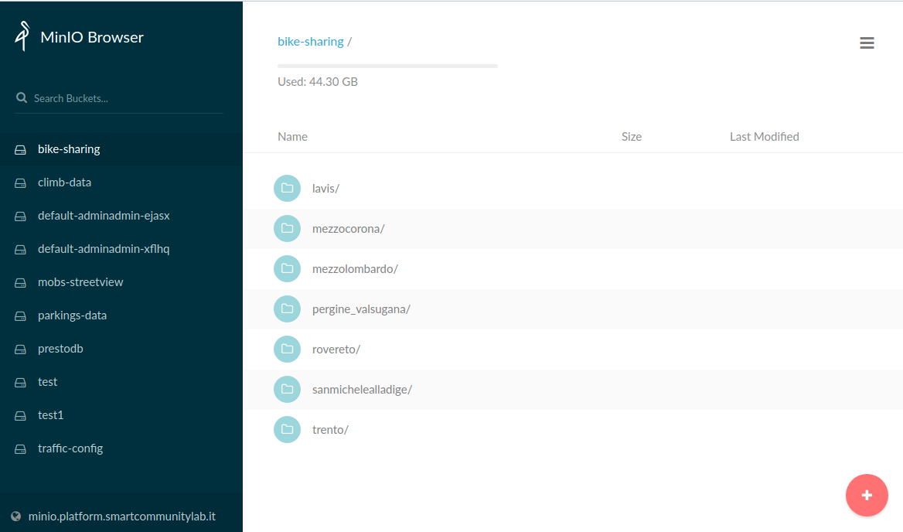

Minio
=============
Minio (https://min.io/) is a high-performance distributed object storage system, open source, 
which provides us with a scalable, lightweight and secure data lake. 
Minio is an open source *S3 Compatible* storage system, which can be directly used by every
application able to understand the *Simple Storage Service (S3)* protocol.

Being purpose-built to serve objects instead of files or data tables, 
Minio can be used to store unstructured/structured/semi-structured data inside a flat addressing space,
while at the same time offering advanced querying and lifecycle capabilities.

Minio can be used to to store any kind of data in the same space,
independently of size, type and structure, and access it via S3 over the network, all while 
respecting and enforcing user permissions, policies and data-retention locks as defined by administrators.

One of the design principles of object storage is to abstract the lower layers away from
users and applications. Thus, data is exposed and managed as objects instead of files or blocks.
Object storage allows the addressing and identification of individual objects by more than just file 
name and file path, it adds a unique identifier for each object within a bucket,
or across the entire system, to support much larger namespaces and eliminate name collisions.

Furthermore, Minio explicitly separates file metadata from data to support additional capabilities:
instead of a fixed set of metadata available in file systems (filename, creation date, type, etc.),
object storage provides for full function, custom, object-level metadata, where users can store
any kind of metadata meaningful for the application, such as secure hashes, signatures, tags etc.

Minio Browser
---------------
An additional package available within the Minio distribution, the *Minio Browser* is a graphical user 
interface dedicated to management of objects within the storage system.
Structured as an independent web application, it can be accessed over the network via browser and enables
users to upload, download, delete, move, rename objects of any size and kind.

Screenshots
-------------

Installation
----------------
Being a *cloud-native* application, Minio can be installed by pulling an image within a cloud 
environment, either local or remote, and deploy a container attached to a permanent storage such as
physical or virtual disks, network shares or cloud storage systems.

In order to test locally it is enough to leverage *Docker* to run the container via

    $ docker pull minio/minio
    $ docker run -p 9000:9000 minio/minio server /data

and then the service will be accessible over the port 9000.

In a proper cloud environment, *Kubernetes* will provide the base stack and the administrators 
will be able to either leverage the preconfigured *helm charts* or the custom *operator*.
See https://docs.min.io/docs/minio-deployment-quickstart-guide.html for further information.

Digital Hub integration
------------------------
A cloud native system such as Minio is inherently designed to be utilized concurrently by many different
users and tenants. Minio natively supports:

* multiple users
* multiple spaces (*buckets*) with dedicated access and lifecycle policies
* complex policies with the ability to discriminate actions and capabilities for users based on various attributes
* externally provided *Key Management Systems (KMS)* to securely handle and distribute encryption keys

Nevertheless, it is mandatory for a properly usable product to integrate a management system, able to
create,manage and destroy resources and coordinate user and policies. 

The *Resource Manager* integration
provides a central place for handling different kind of resources, such as minio buckets, by offering
users a self-action portal, all while ensuring the correct management of policies and permissions.

The RM will enrich user-created buckets with a dedicated access policy, which will enable all tenant
members to access the system, as dictated by *AAC* and *OrgManager* roles.

Furthermore, the *Minio Browser* will be integrated directly with *AAC* in order to 
enable direct access via user credentials, by converting at login tenants and groups to the proper bucket policy
defined by the *RM* at bucket creation.

Eventually, end users will be able to autonomously provision a private bucket in Minio via *Resource Manager*,
and the directly access the Browser with *AAC* Single-Sign-On (SSO), while their applications will 
dynamically provision access credentials via *RM* and *Vault*.

This approach ensures that credentials and policies will be securely handled, without limiting 
end user capabilities or introducing additional steps.