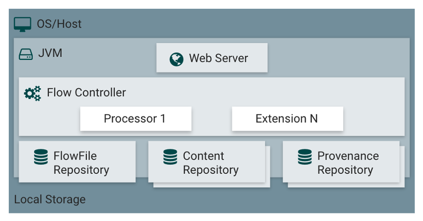
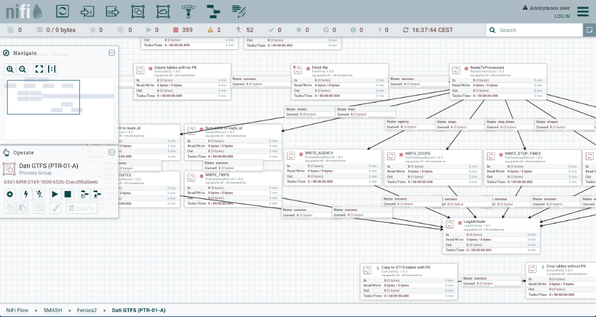

Apache Nifi
======================

Apache NiFi offers the functionality of elaboration, trasnformation, and distribution of data. 
NiFi collects these data from the sources of different types and brings it to the corresponding destionations,
where the data is stored for further exposure or analysis.

Apache NiFi consistes of two elements: data flow modelling environment, where the data transformation process from 
the source to the destination is defined, and the run-time engine, where the process is being executed. This 
data elaboration process may be triggered in two different modes. In case of "active" sources (working in "push" 
mode), such as REST API of the Apache NiFi for process execution, message queues, etc, the process is activated
externally. In case of "passive" sources, such as FTP or external APIs, the process may be activated according
to the schedule defined by the developer. The intermediate nodes allow for various transformation activites, 
data agregration, scripting, etc.

Differently from some other components, e.g., from Apache Kafka, the NiFi component is a "programmable" component
and different developers may define and activate different data elaboration processes. These processes
are composed of different execution nodes of type "source" (e.g., FTP file) and "prcoessors" (e.g., format conversion),
with their specific configuration depending on the nature of the node. NiFi define a vast range of the pre-defined 
node types but allows for extensions with new sources and processors. In this way the definition of the processes
becomes available for non-experts.

This figure, for example, defines a process for extracting the GTFS data from the ZIP archive available at the
specific URL, and for storing the data in corresponding tables of a relational DB.

Apache NiFi Multitenancy Model
----------------------------------
The idea of multi-tenancy in NiFi is that process groups represent tenants and have policies defined for them, 
listing which users or user groups are allowed to view or alter them. User groups are equivalent to teams, so 
if permission to view a process group is given to a user group, all users belonging to it can view it.

Users will still be able to see other teams’ process groups on the flow, but they will only appear as rectangles 
that they can neither interact with or view details of. The only information they can see about them is the amount 
of data they are processing.

The reason is that, if a user couldn’t see another team’s process group at all (without even knowing it exists), 
they may create objects on top of it, resulting in a cluttered flow in the eyes of anyone with permissions 
to view process groups of both teams.

Also, by being able to see the amount of data other process groups are processing, if there is a process 
group slowing down the whole flow, a user can tell where the problem resides. Without this ability, 
they would be puzzled, not knowing why their own process group isn’t receiving any data.

The implementation of this model is delegated to the NiFi connector that creates the necessary groups 
and policies using the Apache NiFi REST API. When an organization is created in Organization Manager, 
a new process group will appear on the NiFi flow, named after the organization. 

When new tenants for that organization are defined, each of them will be represented as a new process group nested 
within the organization’s process group, named after the tenant. The NiFi connector will also create multiple user 
groups for those process groups, with different permissions.

Apache NiFi and AAC Integration
-----------------------------------

The integration of the Apache NiFi and the user management relies on the pre-defined OpenID Connect integration
plugin of NiFi. In this way, the integration allows for SSO using the AAC directly, without the necessity to
customize or extend the source code of NiFi. To accomplish this, it is necessary to configure a client app in AAC
and use the client ID and secret within Apache NiFi configuration. The validation of the user and their roles
within NiFi relies on the data previsously stored through NiFi APIs. 

The details about the Apache NiFi configuration for the OpenID Connect integration can be found here: https://nifi.apache.org/docs/nifi-docs/.

