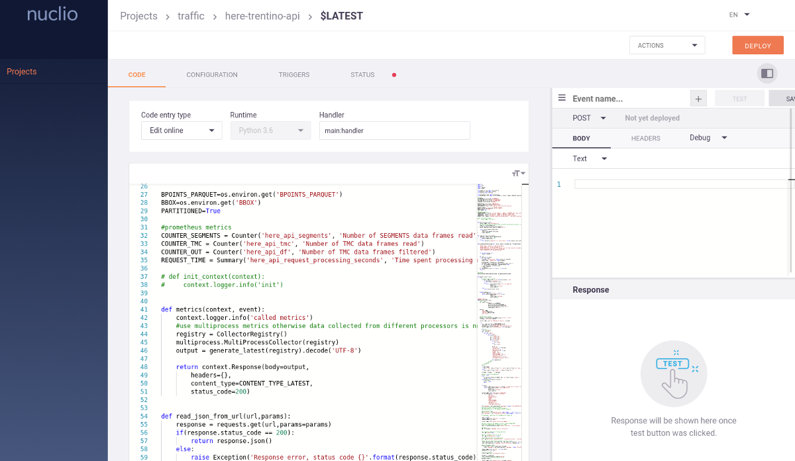

Nuclio
============
Nuclio (https://nuclio.io) is an open source serverless platform built on top of Kubernetes.

It is an highly optimized *Function-As-A-Service* solution, tailored for high performance
computing, with minimal maintenance overhead and near-realtime performance.

Being written since its inception with data science and modern computing in mind, Nuclio 
offers a first-class support for data science (e.g. *machine-learning*) projects, with GPU 
acceleration and unlimited execution time.

FaaS
-----------------
The main idea behind the *serverless* moniker is to focus on the development of code, while 
the execution environment is managed by a third-party, and the developers pay only 
for the resources consumed by the execution of their code, not for the allocation, provisioning and 
management of servers. It builds on the idea of *Platform-As-A-Service (PaaS)*, and moves ahead
by decoupling application code from *data* and *states*, which are managed in external systems,
leaving only the *business logic* in the application layer.

The enabling factor for going *serverless* is the adoption of a **Function-As-A-Service (Faas)** model,
where single task applications are designed, developed and deployed as single, composable 
units of code which are executed in *stateless, ephemeral* containers managed by the underlying 
stack. Furthermore, functions are usually executed in an *event-driven* fashion, an approach
which enables rapid and easy scalability, asynchronous execution plans and optimal resource
consumption.

Nuclio is a *FaaS* platform, built on Kubernetes, which enables users into 
developing, executing and monitoring *functions* in a variety of programming languages 
such as *Python*, *Javascript*, *Java*, *Go* and deploy those blocks as scalable pods within
the underlying cluster. 

The platform will transparently and automatically handle tasks such as compiling code, building
images, defining resources allocations, deploy pods, handle auto-scaling, wire connectivity and 
handle incoming requests via one of the numerous trigger protocols such as HTTP, MQTT, Kafka etc.

The adoption of the *serverless* pattern encourages developers to focus on well-defined
units of business logic, without making premature optimization decisions related 
to how the logic is deployed or scaled.

As a result, development focus is on a single function or module rather than a service
with a large surface area: serverless frees the developer from deployment concerns 
and allows them to focus on factoring the application following logical encapsulation lines, 
with tangible gains in speed of iteration, code complexity, quality and performance.

Furthermore, the usage of a pre-defined and highly optimized execution environment,
via the encapsulation of the function code performed at compilation by the platform, enables
the adoption of state-of-the-art handlers for triggers and connections, with performance and 
resource usage benefits that are obtained independently of the developers, which won't 
need to perform long and time-consuming optimization tasks.

Use cases
---------------
We can identify three main use cases and event sources:

- Synchronous: service is invoked and provides an immediate response in return (e.g. HTTP request)
- Async: push a message on a queue/broker which will trigger an action later (e.g. email or an S3 change notification)
- Streaming: a continuous data flow needs to be processed by a function and results put in another system

In every one of these cases a function, written in any of the supported programming languages, can 
fully satisfy the requirements and provide an easy and immediate way to deliver a 
working solution, without the overhead of defining a project, a stack for an API, a deployment
configuration etc.

Some examples are:

- data collection in any form, being it source scraping, external acquisition, direct upload, message-based..
- data transformation, both as real-time streaming and as batch
- change-data-capture for database systems
- data processing, on-demand and scheduled or event-triggered
- data access

Any kind of job, which can be designed as a stateless unit whose execution is externally 
triggered (e.g. event based) can be easily written as a function, and immediately deployed as 
an high performance service with minimal effort and cost.

Nuclio dashboard and cli
--------------------------
While the core Nuclio platform is executed as a backend service inside the Kubernetes cluster,
with no direct user interaction, the system provides additional components which 
can handle the:

- definition of functions
- configuration of execution environments
- configuration of deployments
- monitoring of function state
- development console
- log inspection

The **Nuclio dashboard** is the graphical user interface, which enables users to self-manage
their platform and all the functions. The *DigitalHub* integration adds an oauth-based 
login to the web application, thanks to *AAC*.

A cli tool, named **nuctl**, can be installed locally on developers workstations and be used 
to perform the same set of operations as the dashboard, in a scriptable and easiliy operable 
way.

External access
-----------------
Each function deployed within the serverless platform can be bounded to an *HTTP* trigger,
which exposes a *service* for *syncronous* interaction.
Given the fact that any function is executed as an independent *pod* in Kubernetes,
we can discover that by enabling the HTTP trigger we can directly invoke the function by calling
the dedicated *NodePort* published by Kubernetes. 

This approach can satisfy many needs, but is limited to *in-cluster* access, since ports bounded
to services are not exposed on the Internet. 

To enable the development and testing of functions from the developers workstations, 
we can adopt 2 solutions:

- call the function via *Nuclio dashboard*, which acts as a *reverse proxy* and exposes a console for testing and debugging
- build a *mTLS tunnel* between the platform and the user pc, via *ghostunnel*

Instead, when we need to expose a function for a broader audience, we can leverage a completely 
different approach, which integrates with standard Kubernetes guidelines and implements an *Ingress* rule.
Each function can thus be *mapped* to a specific path, usually the function name itself, and this
information is then written as an annotation to the deployment in Kubernets, as an Ingress definition.
An *Ingress controller*, running inside the cluster, acts as a reverse proxy, and listens
for requests and provides an autoconfiguring service, able to map path and ports and properly 
handle outside connectivity.

The result is a completely automated, observable and cloud-native configuration of ingress routes,
which provides all the advantages of a proper proxy (SSL support, logging, rate limiting, 
auditing, authorization etc) to any function, without requiring a manual setup.

Workflows
----------------
In many cases functions are deployed and used alone, but 
sometimes they are invoked as a single processing block part of a bigger
process which can be defined as a *workflow*.

While many dedicated tools are designed and developed from the ground up to satisfy the 
requirements of *workflows* and adopt *flow processing* (e.g. Nifi), serverless 
platforms are increasingly being used as the base layer for complex *function composition* processes.

Instead of adopting a single server to handle the whole process flow, the approach 
with serverless is to define many small processing blocks and deploy them as 
independent functions, which are then connected over some kind of 
*streaming platform* (such as Kafka) which collects, organizes, distributes and persists data 
to functions.
The main advantages of this solution are *scalability*, *robustness*, *performance*, *observability*
and the low level of *complexity* of the single blocks, but the overall design of the 
workflow and its global status can become complex and obscure. 

One viable solution is the integration with **Kubeflow** (https://www.kubeflow.org/),
an open source project aimed at offering a simple, portable and scalable framework for 
defining, executing and monitoring data science workflows on *Kubernetes*.

Digital hub integration
---------------------------

Nuclio is deployed inside the Kubernetes cluster on the digital hub cloud.

The integration relies on the definition of *namespaces* in Kubernetes, which isolate tenants
in a multi-tenent environment and avoid the reachability of pods from the outside.

Any tenant will have access to a dedicated *Nuclio* deployment, which is a *namespace*,
and each authorized user will be able to deploy a function via 

- the nuclio *dashboard*
- the cli tool *nuctl*

The *authentication* and *authorization* steps are performed via *AAC* for user access, 
and via *Vault* for credentials and secrets management.

The complete integration will give ensure that functions will be able to *acquire*
dynamically the credentials required for the integration with backend services as databases,
S3 storage, message brokers etc. thanks to the *role delegation* performed via *AAC* and *Vault*.

This solution will avoid the need to create, store and distribute dedicated credential sets
for any given function, or even worse the adoption of a single set of credentials for the whole 
platform. Instead, by guaranteeing the availability of the *Vault* at runtime, and thanks 
to the integration with Kubernetes and Nuclio, we could be able to obtain at startup 
the required accounts, within the *least-required privilege* principle.

Installation
---------------------
Production-ready deployments require the usage of Kubernetes as cluster-engine. 
For instructions follow    https://nuclio.io/docs/latest/setup/k8s/getting-started-k8s/

In order to provide a locally usable development environment, Nuclio also supports the 
execution within *Docker*, with limitations in terms of performance, scalability and automation 
support. The use case for Docker is to evaluate the platform and locally test the functions in
an initial phase. 

To run a local instance of the platform execute the following:
::
    docker run -p 8070:8070 -v /var/run/docker.sock:/var/run/docker.sock -v /tmp:/tmp --name nuclio-dashboard quay.io/nuclio/dashboard:stable-amd64

By browsing to http://localhost:8070, users will be able to 
create a project and add a function.

When run outside of Kubernetes, the dashboard will simply deploy to the local Docker daemon. 
Developers will be able to use the usual docker tools to inspect the logs, start/stop the container 
and access the console.

