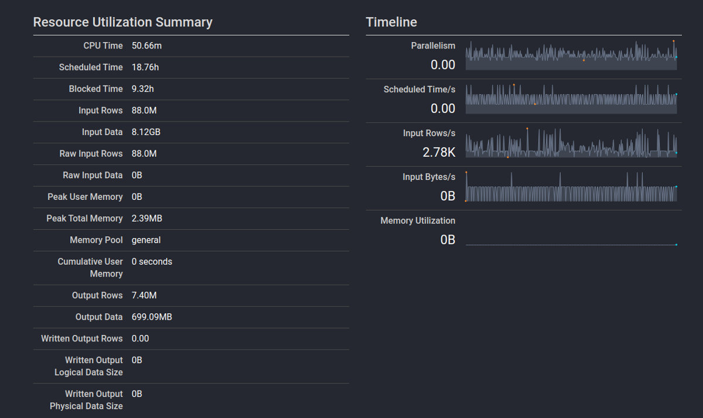

Presto
==========

Presto (https://prestosql.io/) is an open source distributed SQL query engine, 
originally developed at Facebook, which is able to optimally respond to all the 
complex analytical
queries needed by data scientists by performing fast in-memory operations and
directly leveraging the data lake abilities.

The main factor which drives the adoption of such a tool is its unique ability to natively
query data directly from where it is stored, being it a RDBMS,
an object storage such as Minio, or even an Hadoop cluster, without the need for complex,
costly and lengthy ingestion steps, which usually involve copying and transforming data via ETL pipelines.
Instead, by directly connecting to backend systems which hold the data, 
and by leveraging their native capabilities and querying languages, 
Presto can offer an unified ANSI SQL console with a complete view over the datasets.

By performing in-memory computations, and leveraging a distributed query engine optimized 
for low latency, Presto is able to offer remarkable performance for queries which span 
very large datasets (up to *petabytes*), stored inside different backend systems,
all in a transparent way.

Furthermore, Presto offers many advanced capabilities, 
such as spatial and geographical support, which can be used independently 
of the presence of the same tools in the backend system. 

When paired with an advanced storage system such as Minio, 
Presto can exploit the advanced querying features of the *S3 Select* protocol and 
minimize the amount of data transferred from the backend systems, 
while also leveraging the push-down of predicates to further reduce the 
amount of work needed to compile the query results.

Digital Hub integration
-----------------------------
Given the specialized and complex tasks performed by Presto, and the vast amount of 
resources needed to properly handle large datasets, the integration is still in a preliminary phase.

The design of the system requires a direct integration between *Presto* and the *Resource Manager*, 
in order to make Presto aware of the various storage systems and datasets such as RDBMS databases,
document collections or object storage buckets.

Furthermore, *Presto* will have to discover or obtain proper access credentials, either via user delegation
through *AAC* or via direct access to the credentials *Vault*. 

Screenshots
-------------

