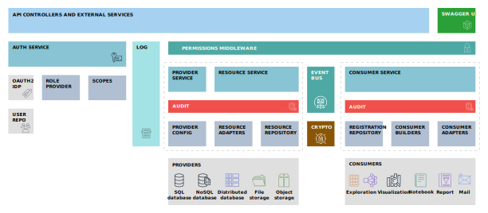
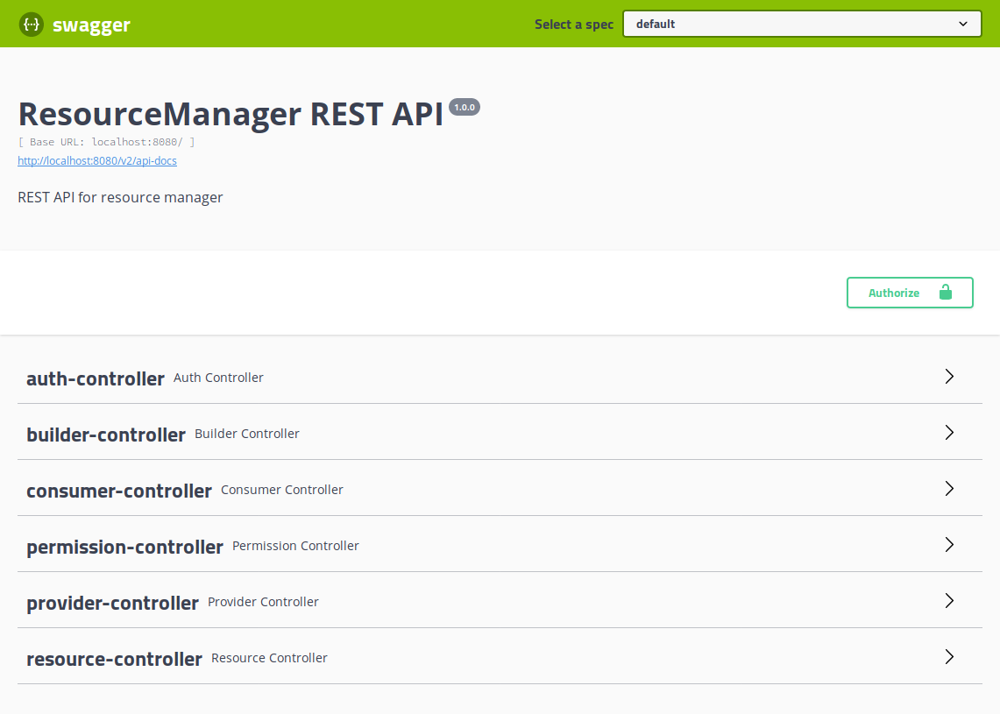
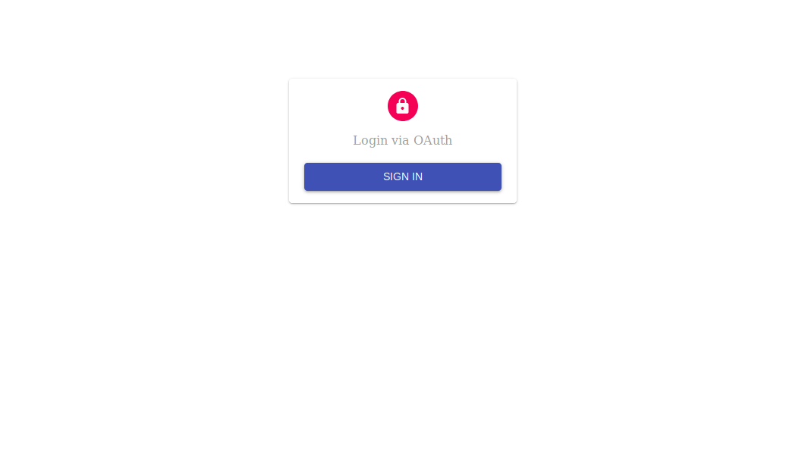
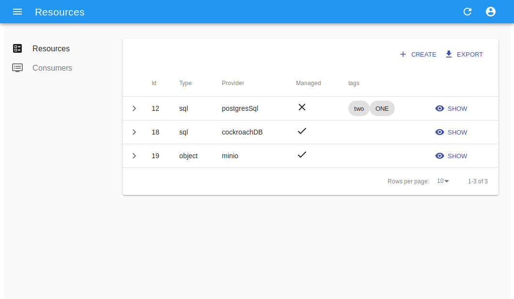
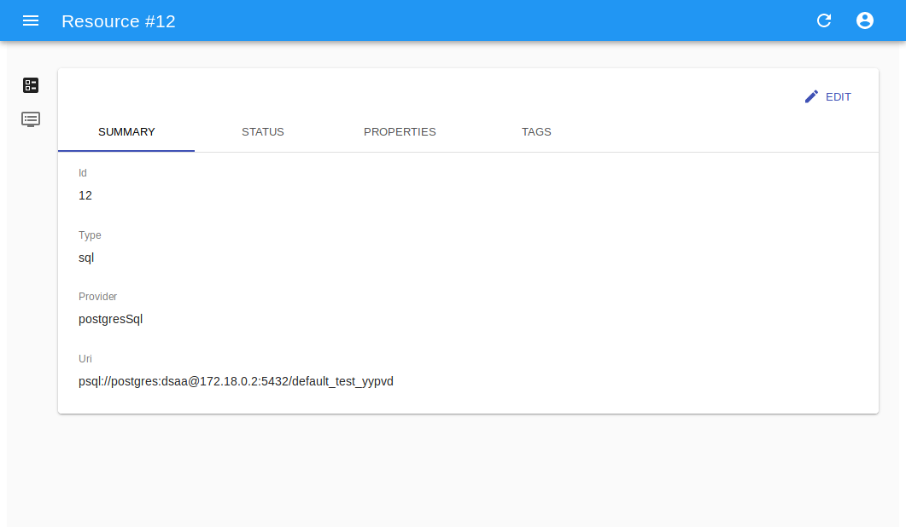
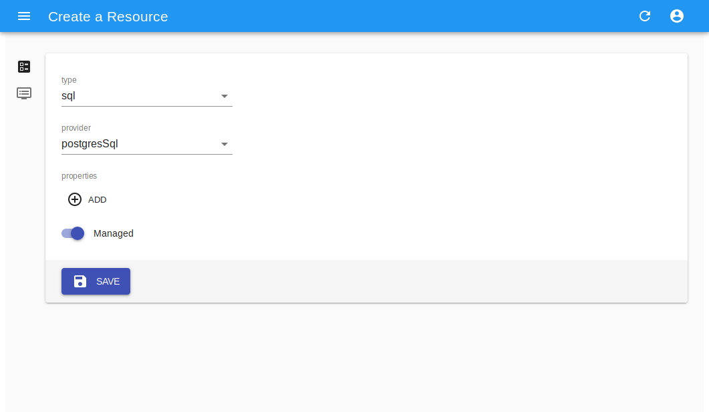
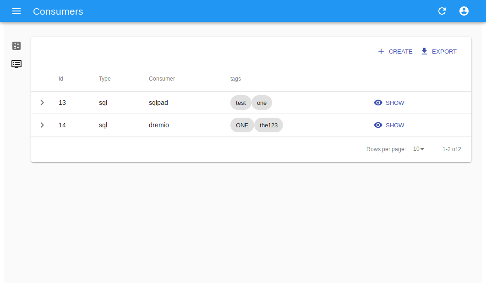
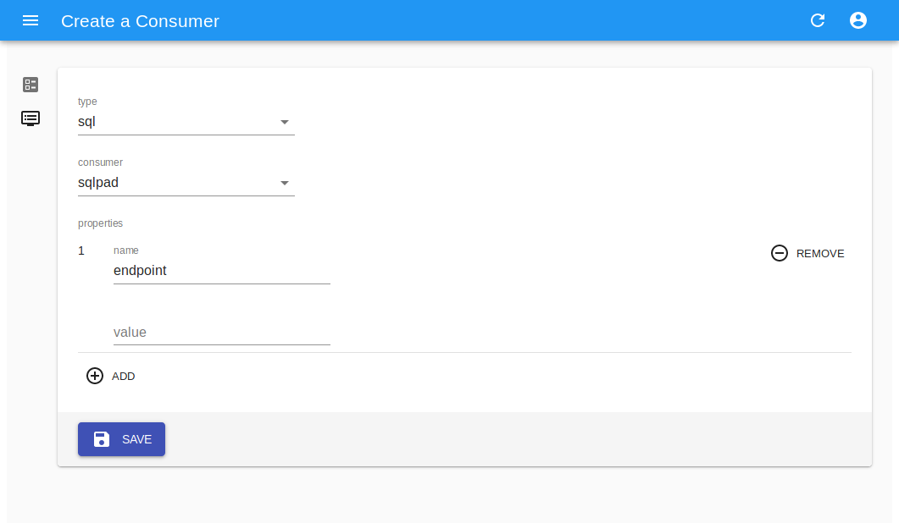

Resource Manager
======================
The ResourceManager is a core component of the data platform.
It has the task to manage resoures such as databases or file stores for the various tenants, acting as a *mediator* for 
managing the lifecycle of resources.

In a complex, multi-tenant and multi-provider environment, it is fundamental to adequately segregate users and roles, mainly for **security**, **privacy** and **accountability** reasons.
The ResourceManager is uniquely positioned in the platform architecture to fullfill all these requirements, by acting as:

- a *coordinator* which provides users with the appropriate resources for their scope
- a *manager* which intermediates access to resource providers, avoiding the necessity for a delegation of administrative access to end users for self-management. Admin accounts are managed by the platform, and used exclusively by the resource manager to create **resources** and **limited access credentials** for end users
- a *logger/auditor* for events related to resources, such as creation or removal
- a *registry* for resources and access credentials

Additionally, the ResourceManager can act as **dispatcher** for resources, with the unique ability of connecting external **consumers** to resources, such as data exploration, visualization or analytics softwares.

.. note:: The software is currently in **beta**, not suitable for deployment outside of test environments.

Design
---------------

The core of the ResourceManager is build around 3 components:

- the *resource service*, which alongs the local repository handles the storage and retrieval of resource entities
- the *provider service*, which is responsible for the communication with backend resource providers and handles the *creation*, *update*, *check* and *delete* of resources
- the *consumer service*, which providers resource consumers with details of resource-related events, along with all the data required for resource access such as *user credentials*, *connection URIs* and properties.

The various components are interconnected both in a **synchronous way**, via direct service call, and in an **asynchronous way**, via an internal event bus built on *message delivery*.

The idea is to provide an agile and extensible building block for the data platform, with a small deployment footprint, completely manageable via API calls to fullfil the *integration*, *automation* and *observability* requirements.

Architecture
-------------

The software is divided into 4 logical layers:

- the *access layer* which exposes the API (REST controllers, services), the user interface, the Swagger UI and documentation
- the *service layer*, which handles the business logic, the authorization and permissions system, the event bus and the system configuration
- the *persistence layer* which handles the safe storage of resource definitions and consumer registrations
- the *adapter/connectors layer*, which provides the required glue between external actors (providers and consumers) and the service layer

Additionally, specific components are vertically integrated to offer *audit*, *log* and other common functionalities.

The modular system allows the development of specific *providers* and *consumers* by implementing well-defined interfaces, and
the configuration system permits the activation of only specific classes.

Scopes
--------
One of the project goals is providing a way to properly share resource providers between different, isolated and dedicated **scopes**.
Do note that this does not mean that *resources* are shared between projects, tenants or users, 
but that the *providers*, as in database clusters, storages etc, can be used at the same by different entities while keeping the single resources isolated.

**Scopes** are the internal definition for areas which logically *contain* resources and consumers. A group of users belonging to the same scope will see
the same slice of the system: all the resources and consumers defined for the current scope, and nothing else.

The advantage of sharing backend systems, in a proper multi-tenant way, with clear boundaries relies on proper *scoping* of resources inside backends, and 
at the same time on **single-scope user credentials**, which ensure that users won't have the ability to access resources owned by another scope.

This approach must also ensure that no name collision between isolated scopes happens: since users have no visibility of other scopes, they can not verify 
if a given idenfier (for example a database *name*) is already used on the backend server. At the same time, backend systems do not possess information about 
*scopes* and thus can not autonomously decide. This means that, without proper supervision, **id collisions** could happen. 
Depending of the kind of systems involved, this could mean a simple error or the unwanted sharing of a single resource between different scopes.

As an example, let's review the following cases:

- an SQL provider such as PostgresSQL will throw an error on creation of a database if the name is already taken, leading to an **error**
- a NoSQL provider such as MongoDB, via automatic collection creation, will implicitely create a database on a write access, or reuse one if it already exists, leading to **data sharing**

The ResourceManager, thanks to the **scope** concept, properly isolates tenants by ensuring both **collision-free scoped identifiers**, guarantiing uniqueness on any given provider,
and by providing dedicated **scoped user credentials**, which ensure limited access to backend systems.

Security
-------------

Due to its unique positioning in the platform architecture, the ResourceManager is able to ensure 
a proper separation of duties between *end users* managing their resources and accessing them via the various internal or external consumers,
and the *administrators* which install, configure and manage resource providers such as RDBMS, cloud storage backends, compute units etc.

By leveraging administrators from the tedious task of creating resources for end users, the ResourceManager can at the same time ensure that the **privileged credentials** 
required to manage resource providers are never leaked to end-users, by contextually providing **single-scope user credentials** for each and every resource.

This design choice ensures that at any given time, the leakage or exposition of a single account won't give access to other resources offered by the same provider.
While potentially cumbersome for end-users, the security and privacy objectives are valued as primary targets for the data platform.

Since the ResourceManager is given the task of creating user credentials for direct resoure access, **secure storage** of sensitive data is a mandatory requirement.
An encryption schema, based on AES symmetric cipher, ensures that data at rest in the local database is properly secured, and decrypted only for authorized access.

Properties for encryption configuration are :

.. code-block:: javascript

    #encrypt
    encrypt.enabled=true
    encrypt.key=*****************************

These can be defined via an ``application-local.properties`` file or via ``ENV`` variables.

Future development should introduce:

- additional per-scope keys for storage, or externally-provided keys (for example KMS or SSE-C approaches)
- temporary credentials generation for limited scope/time access to resources

In particular, an hypothetical system composed of an *identity provider*, a *key provider* and the *ResourceManager* as separated entities could ensure that all the user credentials, 
along with any user-provided data such as custom properties, annotations and eventually *data exports* are adequately protected via encryption, all within a Zero-Trust 
deployment where not even the manager has direct access to protected data.

Authentication and Authorization
------------------------------------
The ResourceManager is a backend component of the data platform. As such, its target is to provide a single service without replicating the capabilities of 
other pre-existing components. User *authentication* is one of these shared functionalities, which can be delegated to a dedicated **identity provider**.
The system supports external authentication via **OAuth2**, where a user accessing the API must provide a valid **access token**, an opaque string generated by the 
identity provider after a successful authentication. Via backend call to a validation endpoint, the ResourceManager can retrive the user **identification** for 
the *bearer token*, along with all the information required to properly **authorize** the request.

The ResourceManager does employ a scoped *Role-Based Access control*, where roles are bounded to the specific scope (ie tenant/group/project..).
The permissions related to the *entities* and the relative *actions* are statically connected to a set of roles, where each of these defines a specific model in the system.

- ``ROLE_ADMIN`` identifies the administrator for the scope, which can perform **any operation on any entity**, and has complete access to all the data
- ``ROLE_RESOURCE_ADMIN`` identifies a limited administrator with all the permissions related to *resource* management and access, and no permissions for the *consumers* 
- ``ROLE_CONSUMER_ADMIN`` identifies a limited administator, with all the permissions on *consumers* but no management rights for *resources*
- ``ROLE_USER`` identifies an **authenticated user** which has complete *read-access* to both resources and consumers, included protected data, but no admin rights.

As previously stated, roles are bounded to a **scope**, which is the system definition of a shared space between users. 
This means that a single user can possess different roles, impersonating the relative actor, within different domains, 
for example a mere ``USER`` in a given shared scope, and ``ADMIN``  in another personal space.

The configuration for authentication and authorization relies on an external OAuth2 provider, which should ensure user authentication and then
provide the information about roles assignment for any given scope. 
If a user does not possess a role in a given scope, it is deemed as *unauthorized* by the backend.

Additionally, a **scope filter** can be configured via the ``scope.list`` property, which requires that any requested or claimed scope is included in the given list.
This can be leveraged to limit access to a given resource manager to only users belonging to a given group or tenant.

The properties for configuration are :

.. code-block:: javascript

    #oauth
    rest.security.issuer-uri=
    security.oauth2.client.client-id=resourcemanager
    security.oauth2.client.client-secret=*************
    security.oauth2.client.access-token-uri=${rest.security.issuer-uri}/protocol/openid-connect/token
    security.oauth2.client.user-authorization-uri=${rest.security.issuer-uri}/protocol/openid-connect/auth
    security.oauth2.resource.id=resourcemanager
    security.oauth2.resource.token-info-uri=${rest.security.issuer-uri}/protocol/openid-connect/token/introspect
    security.oauth2.resource.user-info-uri=${rest.security.issuer-uri}/protocol/openid-connect/userinfo
    security.oauth2.resource.jwk.key-set-uri=${rest.security.issuer-uri}/protocol/openid-connect/certs

    #scopes
    scopes.enabled=true
    scopes.default=default
    scopes.list=
    scopes.roles.mapping.admin=resourcemanager/<scope>:ROLE_ADMIN
    scopes.roles.mapping.resourceAdmin=
    scopes.roles.mapping.consumerAdmin=
    scopes.roles.mapping.user=resourcemanager/<scope>:ROLE_USER

These can be defined via an ``application-local.properties`` file or via ``ENV`` variables.

Providers
---------------------

Resource providers are backend services which offer a specific kind of resource, such as *SQL databases*, *NoSQL* data stores, *Object or file storages*.
While management of such backend services is demanded to operators and platform managers, **resources** lifecycle is directly handled by end users via ResourceManager.

A *provider adapter* connects the management stack with a specific instance of a particular software, such as a single PostgresSQL database server.
When an authorized user requests the creation of a new resource, the adapter will translate the operation into a series of backend calls, via native protocols,
aimed at creating a single resource, uniquely assigned to a single-scope user credential, which will then be made available to end-users.

The same translation process happens for all the significative operations supported by the platform:

- ``CREATE`` requires the creation of a resource to the provider, with an optional ``name`` and provider-specific ``properties``
- ``UPDATE`` communicates the modification of user-editable properties such as attributes, tags or extensions
- ``CHECK`` instructs the adapter to verify the existance and accessibility of the resource and the related user-account, and to eventually fix access problems
- ``DELETE`` requires the removal of the resoure, the user account and all the related data, such as tables, temporary files, caches, backups etc

Future development could introduce additional operations such as:

- ``EXPORT`` to extract data from a backend into a downloadable archive
- ``IMPORT`` to import a source dataset into a newly instantiated resource, or deploy a model 
- ``BACKUP`` to require a server-side backup of a resource, along with all the data, for versioning or data recovery
- ``CLONE`` to quickly reproduce a project or an environment via cloning resources and data repositories along with all the data
- ``CLEANUP`` to restore a resource to a clean state, which could be empty or conform to an seed template

Currently, the software assumes that any given provider has a single instantiation, 
since the configuration is provided statically at startup and can not be changed during execution.
This means that, in a case where multiple resource backends happen to offer the same provider, multiple resource managers would be deployed, 
in a *one-to-one* mapping where each would exclusively manage a single instance of the provider.

A future evolution could introduce support for multiple providers of the same class, if the current model results too limited.

The provider system supports **unamanged resources**, which are externally defined and only registered into the ResourceManager.
This mode enables the propagation of resource events and configurations to *consumers*, without at the same delegating the 
administrative rights to the resource manager. The resources ``ADDED`` in this way will be effectively *read-only* for the system and the users.
The removal of an unmanaged resource will simply delete the registration, leaving the provider and the real resource intact.

Consumers
----------------------
Resource consumers are softwares which connect to resource *providers* in order to leverage their capabilities and data. 
As an example, data exploration softwares like *SQLPad*, *Dremio* or data visualization and analysis such as *Superset* or *Metabase*.

Setting up these softwares requires the insertion of connection information, along with credentials, for each resource in each and every provider.
This tedious task, entirely performed by end users in a self-managed system, can and should be automated in order to provide:

- auto-configuration
- consistency
- error prevention
- audit
- security along privilege separation

By demanding configuration to the ResourceManager, users will access such tools with limited credentials, without delegating the ability to administrate resource connections and spaces.
Instead, the ResourceManager will handle the privileged access, and provide configuration detail for each supported resource, depending on both providers and consumers, according to:

- scope
- resource type
- resource provider
- tags

Future improvements could eventually provide additional security, by defining **single-consumer credentials** for each resource, with appropriate privileges
connected with the specific capabilities of the software. 
For example, a data visualization component could leverage *read-only* access with limited visibility of sensitive data, while a CRUD application could receive
full *read-write-delete* privileges over the same resource, with a dedicated user account.

Tags
---------
Tags are user-defined strings which can be used to describe *resources* and *consumers*.
The main objective of their usage is the grouping of entities under logical groups, which are meaningful for end users.
Additionally, *tags* are used internally to filter resources and events during the dispatch of actions, effectively limiting the visibility to consumers.

For example, a consumer such as SQLPad tagged with ``developement`` could obtain visibility on *development* resources as staging and test databases,
and enable users to explore, validate and analyze data, while on the same **scope** a consumer tagged with ``production`` such as a reporting tool would never gain access 
to development resources.

API
---------

The software exposes a REST API, accessible via HTTP at ``http://resourcemanager:8080/api``.

Every management and access operation, both for *resource* and *consumer* entities is available via API.
Exposed endpoints are:

- ``resources`` for resource management
- ``consumers`` for consumer management
- ``builders`` for inquiring the available consumer builders
- ``providers`` for inquiering the avialble resource providers
- ``auth`` for performing UI login via Oauth2
- ``permission`` for introspection of user permission and roles, used by UI after auth

For detailed documentation and a playground, access the included **SwaggerUI** at ``http://resourcemanager:8080/swagger-ui.html``.

API access requires a valid ``Authorization`` header, which should carry a valid ``Bearer token`` obtained by clients from the Oauth2 provider.
The backend will validate the token and use it to recover user information such as *username*, *scopes* and *roles*.

The ResourceManager is natively *multi-tenant* thanks to *scopes*. 

As such, each API call should include the specific ``scope`` either via:

- HTTP Header ``X-Scope``, example ``X-Scope: tenant123``, or
- PATH ``/api/c/<scope>/``, example ``/api/c/tenant123/resources/1``

When requests do not carry a *scope* identifier, the system will refer them to the **default scope**, as configured in the relative property.
This can be used to deploy a *single-tenant* instance, with only a single scope enabled and set as default, and avoid the hassle of including it into each and every call.

User Interface
----------------
Included with each ResourceManager release, a React-admin based user interface provides a simplified graphical way for the management of resources and consumers.
The UI respects authentication and roles, same as the backend.

Login
********************************
Access the interface at ``http://resourcemanager:8080`` and login via OAuth2.

Resource management 
********************************
List and filter resources for a given scope.

Resource detail
********************************
Access resource details along with connection information and user credentials.

Resource creation
********************************
Create a new resource from available providers, either via **creation** for managed or **registration** for unmanaged, which will require the full URI.

Consumer management
********************************
List and filter consumers

Consumer creation
********************************
Create a new consumer, based on available builder, by providing connectin details and consumer-specific properties as for example *endpoint*,*username* etc.

 
.. note:: The UI is currently a beta software, with limited scope (only *default**) and provided AS-IS mainly for testing and development.

Building from source
-----------------------

The codebase can be cloned via ``git`` from the software repository on the local computer.

    git clone 

The software is a SpringBoot project, built with Maven. As such, given the avilability of JDK 1.8 and all the dependencies, the software can be built via:

    mvn clean install

The software will lack the UI, which is separately managed.

The *user interface* is in a dedicated repository and is a React (JS) application. NPM can serve as both the package manager and the build handler.

In order to package the interface and all the assets (images, css, libs) into a deployable artifact, execute:

    npm run package

This will produce a ``dist`` folder with all the resulting files.
To compile a ``release`` build of the whole stack, copy all these assets into the ``public resources`` folder of the maven project.

    cp dist/* $PRJ_FOLDER/src/resources/public/

Then rebuild the maven project 

    mvn clean install

The resulting artifact will contain both the backend and the UI, which will be served at the same port by the internal Jetty http server.

Installation
------------------

Obtain the release artifact, then configure the ``application.properties`` either via config file, with a ``*-local.properties`` file in the classpath,
or via environmental variables.

At minimum, the software expects a valid configuration for:

- local JPA repositories
- OAuth2 
- scopes default and role mapping
- at least one resource provider

Example configuration

.. code-block:: javascript

    # scopes
    scopes.enabled=true
    scopes.default=default
    scopes.list=
    scopes.roles.mapping.admin=resourcemanager/<scope>:ROLE_ADMIN
    scopes.roles.mapping.resourceAdmin=
    scopes.roles.mapping.consumerAdmin=
    scopes.roles.mapping.user=resourcemanager/<scope>:ROLE_USER

    # encrypt
    encrypt.enabled=true
    encrypt.key=aNdRgUkXp2s5v8y0

    # oauth
    rest.security.issuer-uri=http://localhost:8180/auth/realms/test
    security.oauth2.client.client-id=resourcemanager
    security.oauth2.client.client-secret=**************
    security.oauth2.client.access-token-uri=${rest.security.issuer-uri}/protocol/openid-connect/token
    security.oauth2.client.user-authorization-uri=${rest.security.issuer-uri}/protocol/openid-connect/auth
    security.oauth2.resource.id=resourcemanager
    security.oauth2.resource.token-info-uri=${rest.security.issuer-uri}/protocol/openid-connect/token/introspect
    security.oauth2.resource.user-info-uri=${rest.security.issuer-uri}/protocol/openid-connect/userinfo
    security.oauth2.resource.jwk.key-set-uri=${rest.security.issuer-uri}/protocol/openid-connect/certs

    # providers
    providers.mysql.enable=true
    providers.mysql.host=172.17.0.2
    providers.mysql.port=3306
    providers.mysql.username=root
    providers.mysql.password=secret-pw

    # consumers
    consumers.log.enable=true

