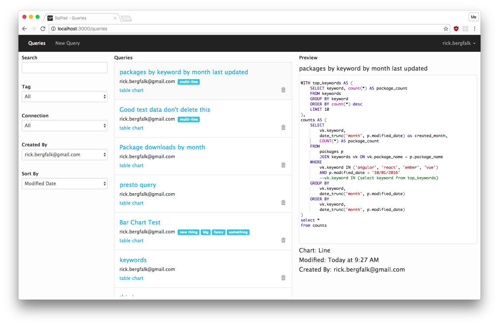
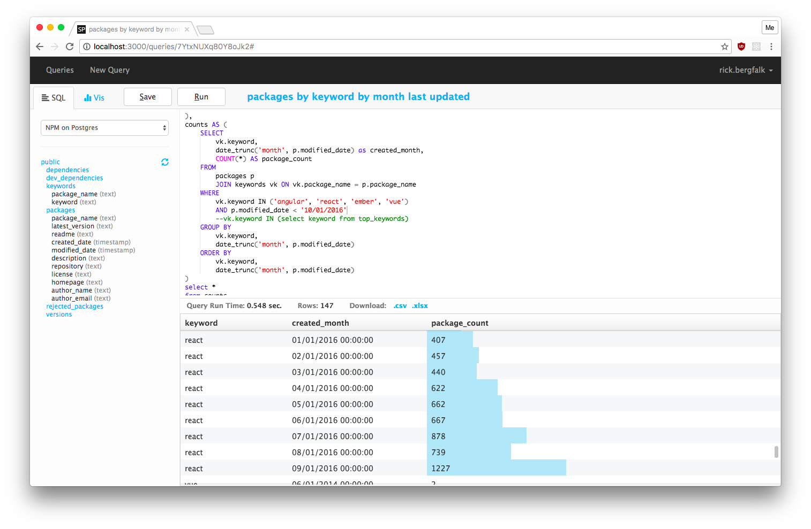
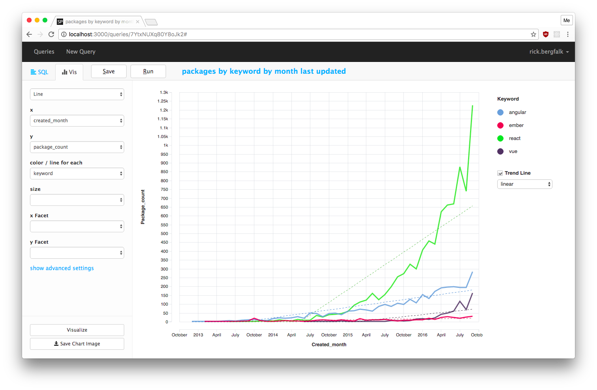
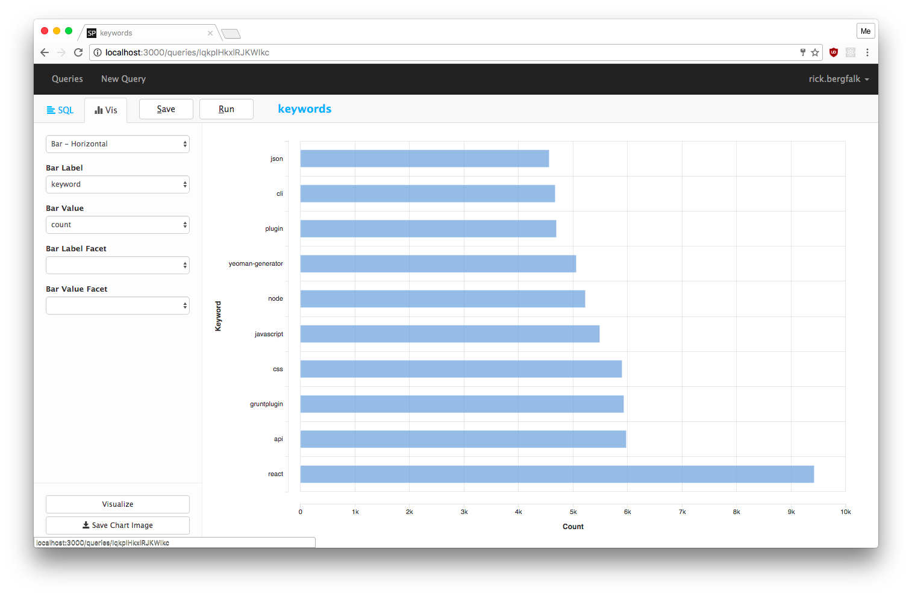

SQLPad
======================

SQLPad is a web app which enables end users to connect via browser to various SQL servers, explore data by writing and running complex SQL queries, and eventually visualize the results.
Additionally, SQLPad includes a simple chart interface able to produce interactive graphs based on SQL results.

SQLPad is the ideal tool for data analysts and scientists who want to perform data exploration and visualization via SQL, all via an intutive and simple web app.

Reference website https://rickbergfalk.github.io/sqlpad/

Screenshots
-------------
*from website*

Installation
--------------------
SQLPad is a Node.js application. As such, it can be installed via NPM and then directly run::

    npm install sqlpad -g
    sqlpad

Alternatively, SQLPad can be executed via Docker, thanks to the official image available at DockerHUB: https://hub.docker.com/r/sqlpad/sqlpad/

Configuration for both the Docker version and the standalone one can be expressed via environmental variables, eg ::

More at https://rickbergfalk.github.io/sqlpad/installation-and-administration/

Platform fork
----------------

In order to integrate SQLPad with OAuth2 login, we have forked the original project at https://github.com/smartcommunitylab/sqlpad

This version, based on the stable **v2 branch** enables the integration of SQLPad with an OAuth2 compliant identity provider, such as **AAC**.

The configuration for establishing the connection requires the following settings (via ENV):

- ``PUBLIC_URL``: Public URL used for OAuth setup and links in email communications. Protocol is expected to be provided. Example: https://mysqlpad.com
- ``OAUTH_AUTHORIZATION_URL``: Authorization endpoint.
- ``OAUTH_TOKEN_URL``: Token endpoint.
- ``OAUTH_USERINFO_URL``: UserInfo endpoint.
- ``OAUTH_CLIENT_ID``: Client ID.
- ``OAUTH_CLIENT_SECRET``: Client Secret.

Additionally, the updated branch implements a basic role authorization schema, which can distinguish between *admins* (with the ability to manage users and connections) and *users* (which can write and execute SQL queries).
In order to leverage this functionality, the following settings are required:

- ``OAUTH_ROLE_FIELD``: OAuth token mapping field for Role discovery, example *authorization*.
- ``OAUTH_ROLE_PREFIX``: OAuth token claim prefix for roles, example *sqlpad:*

Available roles are *admin*/*users*. 
Following the example configuration, a token exposing the following claim enables the user to access as admin::

    { authorization: ["sqlpad:admin"]}

while the following would map to the *user* role::

    { authorization: ["sqlpad:user"]}

When the  claim is missing or does not contain a valid mapping, access is rejected.
Note: Tokens are fetched from UserInfo endpoint.

Building from source
----------------------

Since SQLPad is a Node.js application, developers need to install ``node v8`` or later.
After cloning the repository, install all the dependencies via npm::

    npm install

The code for *frontend* and *backend* are separated into different subfolders.
In order to compile an executable bundle, run the ``build.sh`` script to compile and package the UI::

    scripts/build.sh

Afterwards, the ``server.js`` script can be run via ``node``::

    cd server
    node server.js --dir ../db --port 3010 --base-url '/sqlpad'

This will execute the backend application, which will provide access to both the API backend and the static bundled frontent UI over the configured port.

ODBC
------

Starting from version 2.7.0, SQLPad supports ODBC connections.

As per doc https://github.com/rickbergfalk/sqlpad/wiki/ODBC:

    To enable this support, your setup must meet the odbc module requirements, as well as the requirements for building native modules in node.js via node-gyp.

    When odbc can successfully build, an odbc option should be available on the connections page.

    An initial default query (using SQL standard INFORMATION_SCHEMA) has been provided to pull the schema from your odbc connection, but it may not work with the database you are using, and you may need to provide an alternate query.