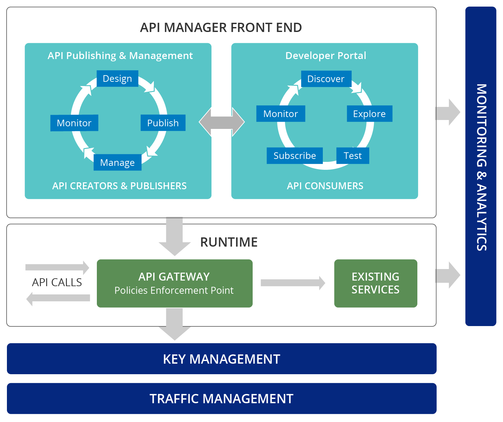

.. _apim:

API Manager (WSO2)
===================

| As an organization implements SOA, it can benefit by exposing core processes, data and services as APIs to the public.
| External parties can mash up these APIs in innovative ways to build new solutions. 
| A business can increase its growth potential and partnership advancements by facilitating developments that are powered by its APIs in a simple, decentralized manner.

| However, leveraging APIs in a collaborative way introduces new challenges in exercising control, establishing trust, security and regulation. As a result, proper API management is crucial.
| API Manager is a complete solution for creating, publishing and managing all aspects of an API and its lifecycle.
| It provides Web interfaces for development teams to deploy and monitor APIs, and for consumers to subscribe to, discover and consume APIs through a user-friendly storefront.

.. toctree::
  :maxdepth: 1
 
  apim_install
  apim_usage
  apim_analytics

