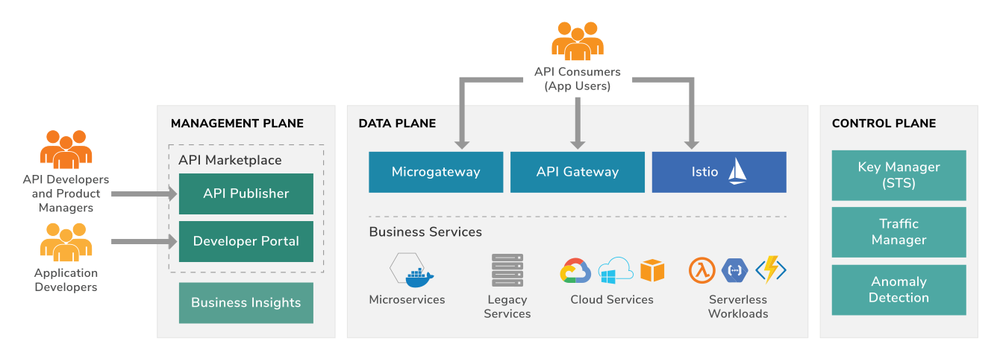

API Manager Usage
===================

WSO2 API Manager is a platform for creating, managing, consuming and monitoring APIs. 
It employs proven SOA best practices to solve a wide range of API management challenges such as API provisioning, API governance, API security and API monitoring. 

WSO2 API Manager comprises of several modules:
	* API Publisher: Define new APIs and manage them.
		A structured GUI designed for API creators to develop, document, scale and version APIs, 
		while also facilitating more API management-related tasks such as publishing APIs, 
		monetization and analyzing statistics.
		
		.. image:: ../assets/apim_publisher.png
		`LEARN MORE <https://docs.wso2.com/display/AM260/Key+Concepts#KeyConcepts-APIPublisher>`_
	* API Store: Browse published APIs and subscribe to them.
		Enables developers to discover APIs, test them before consumption, calculate monetization, get feedback and make feature requests.
		
		.. image:: ../assets/apim_store.png
		`LEARN MORE <https://wso2.com/landing/api-marketplaces/>`_
	* API Gateway: The underlying API runtime
		Supports both forms of centralized and decentralized Gateway capabilities with high scalability 
		characteristics to cater traditional and modern enterprise architectures.
		`LEARN MORE <https://wso2.com/api-management/api-microgateway/>`_
	* API Key Manager: Performs key generation and key validation functionalities.
		The Key Manager is the STS (Security Token Service) that issues tokens that can be used by resource servers for authentication and authorization of requests. 
		It supports a wide range of OAuth grant types and is capable of issuing both opaque and signed self contained tokens.
		`LEARN MORE <https://docs.wso2.com/display/AM260/Key+Concepts#KeyConcepts-KeyManager>`_
	* API Traffic Manager: Performs rate limiting of API requests
		Helps users to regulate API traffic, make APIs and applications available to consumers at different service levels, 
		and secure APIs against security attacks. The Traffic Manager features a dynamic throttling engine to process throttling 
		policies in real-time, including rate limiting of API requests.
		`LEARN MORE <https://docs.wso2.com/display/AM260/Key+Concepts#KeyConcepts-TrafficManager>`_
	* :doc:`apim_analytics`: Provide reports, statistics and graphs on the APIs deployed in WSO2 API Manager
		API Manager integrates with the WSO2 Analytics platform to provide reports, statistics and graphs on the APIs deployed in WSO2 API Manager. 
		Enable Alerts to monitor APIs and react on anomalies. Gain insights by geography, user categories and more.
		Configure alerts to monitor these APIs and detect unusual activity, manage locations via geo location statistics and carry out detailed analysis of the logs.
		`LEARN MORE <https://docs.wso2.com/display/AM260/Key+Concepts#KeyConcepts-TrafficManager>`_
	

API Manager Benefits
---------------------

* Reduce technology risk with extensible open source platform, rich documentation and community contributions.
* Make data-driven decisions through API usage, analytics and insights.
* The flexibility to deploy on-premise, use the public cloud, or both. Easily migrate in between these environments.
* Integrated platform increases team capabilities and efficiency.
* Designed to fit into Monolithic and Microservice Architectures with gateway and microgateway capabilities.
* Granular access control provides security down to the API level.
* Full Lifecycle API Management reduces need for future investments.

API Manager 
.. todo::
