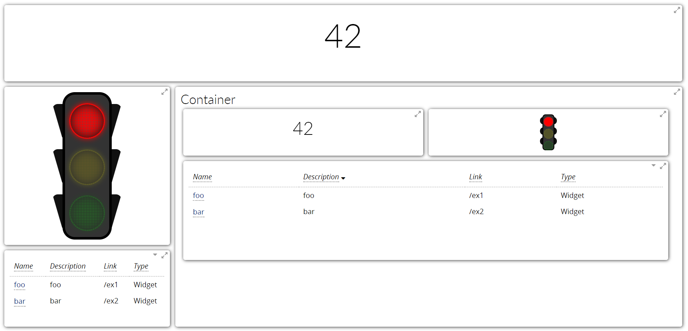

Widget Container
================

The Widget Container widget allows to position other widgets within itself as if it were a page inside the page, i.e., with its own grid layout and theme. Its configuration is similar to that of a regular Page.

In order to add widgets to the container, its **Name property** must be specified. Each widget has an optional **Container property** which holds the name of the Container widget that should contain it. If this property is specified, the widget will be added to the container instead of the Page and its dimensions will be determined by the container grid layout.

Layout Configuration
-------------

The following table illustrates the layout configuration properties available.

================================ ==================== ========================= ==================
Property                         JSON Key             Default                   Description
================================ ==================== ========================= ==================
Grid Columns                     gridColumns                                    Total number of horizonal grid squares available in the grid. The grid squares will be scaled to fit the container. If omitted, the number of columns is calculated dynamically.
Grid Rows                        gridRows                                       Total number of vertical grid squares available in the grid. The grid squares will be scaled vertically to fit the container. If omitted, the grid squares will be literally square, i.e., the height and width will be the same. When omitted, the widgets may not fill the entire container, or they may scroll vertically. Use this property to make widgets scale vertically to fit the container.
Grid Container Height Adjustment gridHeightAdjustment ``0``                     Adjustment (in pixels) to the height of the container when calculating the grid layout. If the value is positive, the container height will have the adjustment added to it (making each row taller). If it is negative, the container height will be reduced (making each row shorter).
Grid Container Width Adjustment  gridWidthAdjustment  ``0``                     Adjustment (in pixels) to the width of the container when calculating the grid layout. If the value is positive, the container width will have the adjustment added to it (making each column wider). If it is negative, the container width will be reduced (making each column skinnier).
Gutter                           gutter               ``10``                    Space (in pixels) between widgets positioned in the grid
Border Width                     borderWidth                                    Pixel width of the border around each widget. Can be set to 0 to remove the border. If omitted, the theme default will be used.
Margin                           margin               ``10``                    Empty margin width (in pixels) around the outer edge of the container. Can be set to 0 to remove the margin.
Scrolling Enabled                scrolling            ``true``                  Enables vertical scrolling of the container to display content longer than the current size
================================ ==================== ========================= ==================

Example
-------------

The following image shows a sample dashboard with a few widgets, both displayed on the page and inside a container. The dashboard JSON definition can be found below.

::

  {
      "dataSources": [{
          "name": "some-links",
          "preload": true,
          "processor": "p = function () {\n    return [{\n        description: 'foo',\n        link: '/ex1',\n        name: 'foo',\n        type: 'Widget'\n    },{\n        description: 'bar',\n        link: '/ex2',\n        name: 'bar',\n        type: 'Widget'\n    }];\n}",
          "type": "javascript"
      }],
      "name": "example-widget-containers",
      "pages": [{
          "frequency": 1,
          "layout": {
              "gridColumns": 4,
              "gridRows": 4
          },
          "widgets": [{
              "gridHeight": 1,
              "gridWidth": 4,
              "numbers": [{
                  "number": "42"
              }],
              "orientation": "horizontal",
              "widget": "number"
          }, {
              "gridHeight": 2,
              "gridWidth": 1,
              "rules": {
                  "red": "${true}"
              },
              "tooltip": "Time To Stop",
              "widget": "stoplight"
          }, {
              "gridHeight": 3,
              "gridWidth": 3,
              "layout": {
                  "gridColumns": 2,
                  "gridRows": 4
              },
              "name": "Cont",
              "title": "Container",
              "widget": "widgetContainer"
          }, {
              "container": "Cont",
              "gridHeight": 1,
              "gridWidth": 1,
              "name": "contained-number",
              "numbers": [{
                  "number": "42"
              }],
              "orientation": "horizontal",
              "widget": "number"
          }, {
              "container": "Cont",
              "gridHeight": 1,
              "gridWidth": 1,
              "name": "contained-stoplight",
              "rules": {
                  "red": "${true}"
              },
              "tooltip": "Time To Stop",
              "widget": "stoplight"
          }, {
              "columns": [{
                  "label": "Name",
                  "link": "#{link}",
                  "name": "name"
              }, {
                  "label": "Description",
                  "name": "description"
              }, {
                  "name": "link"
              }, {
                  "name": "type"
              }],
              "container": "Cont",
              "dataSource": "some-links",
              "gridHeight": 2,
              "gridWidth": 2,
              "name": "contained-table",
              "widget": "table"
          }, {
              "columns": [{
                  "label": "Name",
                  "link": "#{link}",
                  "name": "name"
              }, {
                  "label": "Description",
                  "name": "description"
              }, {
                  "name": "link"
              }, {
                  "name": "type"
              }],
              "dataSource": "some-links",
              "gridHeight": 1,
              "gridWidth": 1,
              "widget": "table"
          }]
      }],
      "parameters": [],
      "sidebar": {
          "showDashboardSidebar": false
      },
      "theme": "light"
  }
