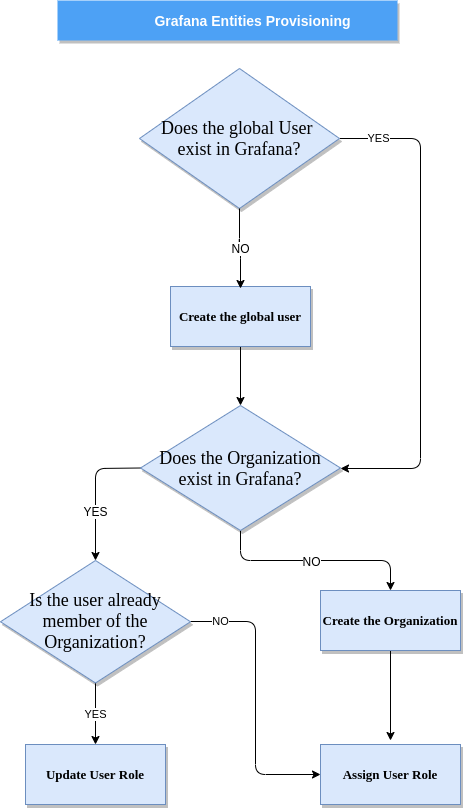

Integration within the DigitalHub platform
--------------------------------------------

| Grafana has been integrated within the DigitalHub platform and aligned with its **multitenancy model**.
| Since Grafana supports multiple organizations in order to support a wide variety of deployment models, each organization can have one or more data sources.
| All dashboards are owned by a particular organization.

| In order to allow the authentication and authorization using `AAC <https://digitalhub.readthedocs.io/en/latest/docs/service/aac.html>`_, within the platform has been integrated a **serverless** `Grafana Connector <https://github.com/scc-digitalhub/grafana-connector>`_  for Organizations and Users provisioning.
| This serverless function creates the organizations and the users on the fly and assigns the proper roles and organizations to the authenticated user.

1. Create AAC OAuth keys
"""""""""""""""""""""""""""""""""
| You can configure AAC OAUTH2 authentication services with Grafana using the generic oauth2 feature.
| To enable the AAC OAuth2 you must register **Grafana Client Application** with AAC. AAC will generate a client ID and secret key for you to use.
| The callback URL must match the full HTTP address that you use in your browser to access Grafana,  **``https://<grafana domain>/login/generic_oauth``**.
| In the section of **Roles & Claims** put the right endpoint of the deployed serverless function. You should use a custom claim function for elaborating the list of roles for Grafana component, similar to the content inside the file customClaims.js in the repository of `Grafana Connector <https://github.com/scc-digitalhub/grafana-connector>`_

2. Enable AAC OAuth in Grafana
"""""""""""""""""""""""""""""""""
Finally set up the **generic oauth module** like this: ::

		#################################### Generic OAuth #######################
		[auth.generic_oauth]
		name = AAC
		enabled = true
		allow_sign_up = true
		client_id = CLIENT_ID_VALUE
		client_secret = CLIENT_SECRET_VALUE
		scopes = profile.basicprofile.me profile.accountprofile.me user.roles.me user.roles.read email openid
		email_attribute_name = email
		email_attribute_path = email
		#profile.basicprofile.me
		role_attribute_path = user.roles.me
		auth_url = http://YOUR_OAUTH_SERVICE/eauth/authorize
		token_url = http://YOUR_OAUTH_SERVICE/oauth/token
		api_url = http://YOUR_OAUTH_SERVICE/userinfo
		team_ids =
		allowed_organizations =
		tls_skip_verify_insecure = true
		tls_client_cert =
		tls_client_key =
		tls_client_ca =
		send_client_credentials_via_post = true

| Restart the Grafana back-end. You should now see a AAC login button on the login page. 
| You can now login with your AAC accounts.

